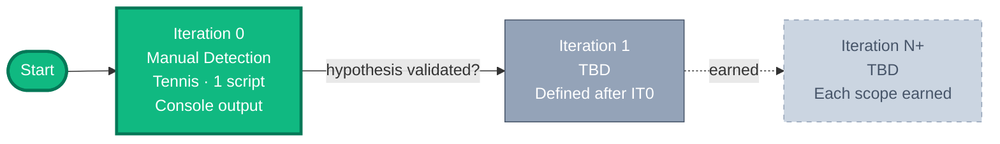

<!-- markdownlint-disable MD033 MD041 -->

# arb-sentinel — Roadmap

**A sport-agnostic arbitrage detection system. Built incrementally. Paper-traded.**

---

## Vision

> Build an arbitrage detection system incrementally, validating each step with a
> concrete business hypothesis before investing in infrastructure. The goal is
> to demonstrate sound platform engineering practices applied to a financial
> domain, not to ship a finished product on day one.

**Three principles** guide every decision:

1. **Validate before you build.** Each iteration tests one hypothesis.
2. **Earn complexity.** No tool enters the stack without a documented reason.
3. **Ship and document.** Every iteration ends with working code + a decision log entry.

---

## The Roadmap

Future iterations are intentionally **not pre-planned**. They will be defined
based on what Iteration 0 teaches us. Speculation about iteration 4 today is
just noise.

---

## Current Iteration — Iteration 0

> **Hypothesis**: arbitrage opportunities are detectable in practice on tennis
> matches using freely available odds data, at a frequency that justifies
> continuing the project.

### Scope

| Aspect | Decision |
|--------|----------|
| **Sport** | Tennis only (2 outcomes — simplest possible market) |
| **Markets** | Match winner (moneyline) |
| **Sources** | The Odds API (free tier) — multiple bookmakers |
| **Output** | Console output when implied probability sum < 1.0 |
| **Persistence** | None — manually observed |
| **Automation** | Run manually on demand |
| **Time budget** | 1–2 weeks at ~5h/week |
| **Capital** | $0 (observation only, no paper trading yet) |

### Stack

Dependencies (managed by `uv`): `httpx`, `pydantic`, `polars`, `pytest`,
`hypothesis`, `ruff`.

### Definition of Done

- [x] Repository initialized with `uv` and proper structure
- [x] CI pipeline running (lint + tests on PR)
- [x] Arbitrage math implemented with property-based tests
- [x] Script pulls tennis odds from The Odds API
- [x] Quotes validated through Pydantic models
- [x] Console output lists arbitrage opportunities

### Explicit Non-Goals

- No automated execution (paper or live)
- No persistence (database, log files)
- No web UI, API, or dashboard
- No AI agents
- No Docker or orchestration
- No deployment — runs locally only

### Validation Criteria

At the end of Iteration 0, we answer:

1. How many real opportunities surfaced during the observation period?
2. What were typical implied-probability gaps?
3. Were the Odds API quotes reliable?
4. Did any flagged "opportunity" turn out to be a calculation bug?
5. **Does the hypothesis hold? If yes, proceed to Iteration 1. If no, pivot.**

---

## Future Considerations

> Tools and practices on the radar for future iterations. Each will be introduced
> only when a concrete signal justifies it — never speculatively.

| Tool / Practice | Signal that will trigger introduction |
|-----------------|---------------------------------------|
| **CI matrix testing** (multiple Python versions) | Project becomes a library others depend on, or we need to test backward compatibility |
| **CI badge in README** | Repository gains visibility / external contributors who benefit from quick status check |
| **Dependabot or Renovatebot** (automated dependency updates) | Manual SHA bumps become tedious as actions and Python deps grow; need structured update PRs |
| **CHANGELOG.md** (with `git-cliff`) | First tagged version, or first external contributor / user |
| **Claude Code** (autonomous agent) | Codebase grows beyond manual maintenance; need for multi-file refactors |
| **Persistent storage** (SQLite then Postgres if needed) | Manual re-running becomes wasteful; need patterns over time |
| **Backtest engine** | Iteration 0 hypothesis validated; need to quantify edge on historical data |
| **AI agents** (single, then multi) | Deterministic detection works; need adaptive judgment |
| **Docker / containerization** | More than 2 services to coordinate, or need for reproducible production |
| **Continuous deployment** | System needs to run 24/7 reliably |

This list is **not exhaustive** and will evolve. The point is to make the
"earn complexity" rule explicit: every addition gets a documented signal.

---

## Decision Log

> Latest decisions at the top. Significant decisions get a dedicated ADR in
> `docs/adr/` when written.

### 2026-05-30 — In-play events filtered to avoid phantom arbitrages

- **Decision**: the mapper rejects events with `commence_time <= now(UTC)`,
  preventing in-play (live) events from reaching the arbitrage math. The
  HTTP client skips these events silently alongside other unmappable
  cases (insufficient quotes).
- **Rationale**: empirical observation during live testing on ATP French
  Open surfaced apparent arbitrages with 20-50% profit ratios on in-play
  events. Investigation revealed these as artifacts of update-latency
  differences between bookmakers: faster bookmakers reflected the current
  match state (set scores, momentum) while slower bookmakers still showed
  stale prices. The math correctly identified the discrepancy, but the
  slower bookmaker corrected within seconds, making the bet unexecutable.
  Filtering in-play events restores the IT0 invariant that detected
  arbitrages should be at least theoretically actionable. Live in-play
  arbitrage detection would require timestamp-aware quote validity,
  suspension detection, and execution latency modeling — out of scope
  for IT0.

### 2026-05-30 — Odds API integration design

- **Decision**: integrate The Odds API as the single odds source for
  IT0. The integration lives in a single module `src/arb_sentinel/odds_api.py`
  with three responsibilities (Pydantic schemas mirroring the API shape,
  mapper to domain models, HTTP client). Exchange-only `h2h_lay` markets
  are filtered out silently in the mapper.
- **Rationale**: the back/lay distinction on exchanges (Betfair, Matchbook)
  represents different financial contracts and would require extending
  the arbitrage math. Filtering `h2h_lay` keeps the math correct without
  complicating IT0. See `docs/design/odds-api-integration.md` for full
  spec and `docs/design/arbitrage-math.md` Out of Scope section for the
  related mathematical scope.

### 2026-05-30 — Local secret management with python-dotenv

- **Decision**: API keys and other secrets are loaded from a local `.env`
  file via `python-dotenv` (the 12-factor app convention). The `.env` file
  is gitignored; `.env.example` documents required variables without
  exposing values.
- **Rationale**: code reads from `os.environ` regardless of the source,
  so the same code path supports local development (`.env`), Docker secrets
  (file mounted to filesystem, entrypoint exports env var), and HashiCorp
  Vault (sidecar populates env vars). Future production migration changes
  the runtime, not the application code.

### 2026-05-23 — Decimal precision lessons in property-based testing

- **Decision**: do not assert exact equality on the multiplicative inverse
  identity (p * O == 1). Instead, verify the probability-validity invariant
  (0 < p < 1) for the general case and exact-equality cases for inputs with
  terminating decimal reciprocals.
- **Rationale**: Decimal arithmetic in Python tracks 28 significant digits
  by default. Divisions like 1/3.74 produce non-terminating decimals that
  get truncated, making p * O slightly less than 1. This is not a bug in
  our code — it is a fundamental property of finite-precision arithmetic.
  Hypothesis surfaced this immediately by finding 3.74 as a falsifying
  example, an instructive reminder that mathematical identities do not
  always survive finite-precision computation.

### 2026-05-23 — Spec-driven design documents under docs/design/

- **Decision**: significant business logic (math, algorithms, key data flows)
  is specified in a design document under `docs/design/` before implementation.
  Each document follows a spec-driven format: Goal, Vocabulary, Invariants,
  Architecture, API, Worked Example, Out of Scope, References, Status.
- **Rationale**: in a financial domain, the math must be auditable by
  non-developers (actuaries, analysts, compliance). Writing the spec first
  also surfaces edge cases and naming issues before they become code debt.
  References to academic and industry sources establish credibility and
  enable independent verification.

### 2026-05-23 — Separate POCs, tests, and examples

- **Decision**: POCs validating design decisions live as executable Python
  scripts in `examples/` and are referenced from documentation. They are
  not part of the test suite (`tests/`).
- **Rationale**: tests enforce invariants and prevent regression. POCs
  explore approaches before committing to them. Examples demonstrate usage.
  Conflating them creates noise: POCs would fail in CI when models change
  intentionally, and tests would become bloated with non-essential scenarios.
  Each artifact has a distinct audience and lifecycle.

### 2026-05-23 — CI pipeline with SHA-pinned actions

- **Decision**: GitHub Actions workflow runs lint (ruff) and tests (pytest)
  on push and PR to main. Single Python version (3.12) for now. Third-party
  actions pinned by commit SHA with version comments, not by tag.
- **Rationale**: SHA pinning protects against supply chain attacks
  (re-tagging, compromised orgs like the March 2026 Trivy incident). SHAs
  were verified against the GitHub API at addition time. At work, we'd rely
  on Nexus as a proxy for upstream protection, but for this public repo
  without a proxy, SHA pinning becomes the primary defense.

### 2026-05-23 — Smoke tests as canary, no __init__.py in tests/

- **Decision**: three smoke tests verify the package imports, exposes its
  main entry point, and can load its runtime dependencies. No __init__.py
  in the tests/ directory.
- **Rationale**: smoke tests catch the cheapest class of bugs (import
  errors, broken entry points) before any business logic runs. Modern
  pytest (2026) discovers tests without requiring __init__.py — including
  it would be legacy boilerplate without functional value.

### 2026-05-23 — Defer Claude Code introduction to learn the stack first

- **Decision**: continue working manually with VS Code + bash for Iteration 0,
  introducing Claude Code only when the codebase grows enough to benefit from
  multi-file refactors and autonomous agent workflows.
- **Rationale**: respects the earn-complexity principle for our own tooling.
  Learning the modern Python stack (uv, ruff, polars, pydantic) by hand builds
  intuition that pays off when delegating to an agent later. A future ADR
  ("ADR-XXXX: When to introduce Claude Code") will be written when the signal
  appears.

### 2026-05-23 — Minimalist README over showcase README

- **Decision**: keep README.md sober and focused on essentials (tagline,
  status, quick start, dev commands, link to ROADMAP). No badges, no marketing.
- **Rationale**: the ROADMAP carries the showcase. The README is a functional
  entry point. Duplication would dilute both. Visitors who want depth click
  through to ROADMAP; visitors who want quick context get it instantly.

### 2026-05-23 — MIT license adopted and file added

- **Decision**: LICENSE file added at repository root, MIT terms with 2026
  copyright to Shayan Hollet.
- **Rationale**: confirms the open source posture decided earlier. MIT chosen
  for maximum permissiveness and recruiter familiarity. PEP 639 SPDX identifier
  already in pyproject.toml.

### 2026-05-18 — Iteration 0 scope finalized

- **Decision**: tennis only, manual run, console output, no persistence,
  no automation, no AI. Free Odds API tier as the single source.
- **Rationale**: validate the core hypothesis (real opportunities exist
  and we can detect them) before investing in any infrastructure.

### 2026-05-18 — Adopted the modern Python stack (uv + ruff + polars + pydantic)

- **Decision**: use `uv` for project management, `ruff` for lint/format,
  `polars` for dataframes, `pydantic` v2 for validation, `httpx` for HTTP.
- **Rationale**: this is the 2026 default stack — faster, more coherent
  than the legacy pip/black/isort/pandas stack.

### 2026-05-18 — Agile incremental approach with earned complexity

- **Decision**: iteration-based progression where each iteration validates
  one business hypothesis. No tool is added without a justifying signal.
- **Rationale**: avoid CV-driven development. Building credibility through
  earned complexity is more valuable than assumed complexity.

### 2026-05-18 — Paper trading only, public repo, English content

- **Decision**: indefinite paper trading (no real money); public repo;
  English-language content.
- **Rationale**: eliminates legal/financial risk; maximizes accessibility
  for an international audience.

---

*Last updated: 2026-05-23 · Iteration 0 in progress*

