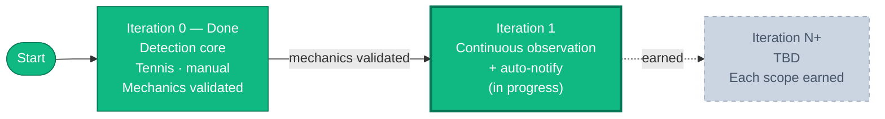

<!-- markdownlint-disable MD033 MD041 -->

# arb-sentinel — Roadmap

**A sport-agnostic arbitrage detection system. Built incrementally. Paper-traded.**

---

## Vision

> Build an arbitrage detection system incrementally, validating each step with a
> concrete business hypothesis before investing in infrastructure. The goal is
> to demonstrate sound platform engineering practices applied to a financial
> domain, not to ship a finished product on day one.

**Three principles** guide every decision:

1. **Validate before you build.** Each iteration tests one hypothesis.
2. **Earn complexity.** No tool enters the stack without a documented reason.
3. **Ship and document.** Every iteration ends with working code + a decision log entry.

---

## The Roadmap

Future iterations are intentionally **not pre-planned**. They are defined based on
what each iteration teaches us. Speculation about iteration 4 today is just noise.

---

## Current Iteration — Iteration 1

> **Hypothesis**: under continuous observation, with sufficient coverage and
> false-positive filtering, do real, clean arbitrage opportunities surface often
> enough to justify continuing — and can a detection be delivered automatically
> when one appears?

Iteration 0 ran detection manually and on demand, which samples too little of a
continuously-moving market to catch a real opportunity. Iteration 1 moves from
manual execution to continuous, windowed background observation with automatic
notification — keeping the detection core unchanged and adding only what the
hypothesis requires.

### Scope

| Aspect | Decision |
|--------|----------|
| **Sport / market** | Tennis, h2h (2 outcomes) — domain validated in IT0 |
| **Coverage** | One active tournament, selected dynamically (`/sports` + priority list) |
| **Source** | The Odds API (free tier), `regions=eu`, `markets=h2h` |
| **Mode** | Continuous observation; windowed polling ~15–25 min |
| **Detection** | IT0 pipeline + phantom filter (outlier-vs-consensus) |
| **Notification** | Discord webhook for clean candidates only |
| **Persistence** | JSONL journal (classified detections) + dedup state |
| **Host** | Always-on, $0 (free tier); manual deploy |
| **Capital** | $0 (observation / paper) |

### Stack

No new Python dependencies. Iteration 1 keeps the IT0 stack — `uv`, `ruff`,
`pydantic`, `hypothesis`, `httpx`, `pytest`, `respx` — and earns nothing beyond it:

- **Notification**: a Discord webhook is a single `POST` via `httpx` (already present).
- **Persistence**: the journal is `json` + a file (standard library).
- **Scheduling**: the OS handles it (cron / systemd) — outside the application code.
- **Secret**: the webhook URL is loaded from `.env` / an environment variable, exactly like `ODDS_API_KEY`.

### Definition of Done

> Order follows the spec-driven discipline: docs → code → deployment → docs.

- [x] Design spec **`docs/design/phantom-filtering.md`** written *before* the code (Goal / Vocabulary / Invariants / Architecture / API / Worked Example / Out of Scope / References / Status)
- [x] **ADR** "When to introduce Claude Code" written in `docs/adr/`
- [x] **Dynamic discovery**: `/sports` → filter active `tennis_*` → priority-based selection (replaces the hardcoded `tennis_atp_french_open`)
- [x] **Phantom filter**: pure functions, property-based tests + fixture case (the ~28% Pinnacle outlier rejected, the ~1.85% candidate preserved)
- [ ] **Discord webhook** notification for clean candidates (URL as a secret)
- [ ] **JSONL journal**: each detection classified (candidate / phantom + reason + margin + book count) + dedup (no re-notification of the same opportunity)
- [ ] **Cycle robustness**: `httpx` timeout + per-cycle `try/except` (a 429 / timeout does not stop the process)
- [ ] **Budget guard**: read `x-requests-remaining` and pause the cycle below a threshold (e.g. < 50 credits)
- [ ] **Single-cycle script**, deployed on the always-on host via cron (active window); deployment documented
- [ ] **CI green** (lint + format + tests), new tests included
- [ ] **ROADMAP**: Iteration 1 section + decision log finalized

### Validation Criteria

At the end of Iteration 1, we answer:

1. How many clean candidate opportunities surfaced over the observation period?
2. What were their typical margins?
3. What fraction of raw detections were phantoms — i.e., is the filter behaving well (false rejects / false positives)?
4. Were notifications timely and free of spam (dedup working)?
5. **Does a clean arbitrage surface often enough to justify Iteration 2** (toward execution modeling / backtesting)? If yes, proceed. If no, the honest finding is that clean pre-match arbitrages are too rare under free-tier coverage — at which point a paid tier or a different market becomes a documented decision.

### Explicit Non-Goals

- No in-play / live (pre-match only)
- No execution (paper or real) — observation + notification only
- No database (JSONL file)
- No AI agents (deterministic selection, no adaptive judgment)
- No multi-sport, no multi-source
- No Docker / CD / observability stack
- No `last_update` staleness filter, no probing event counts via `/odds`

---

## Iteration 0 — Complete

> **Hypothesis**: arbitrage opportunities are detectable in practice on tennis
> matches using freely available odds data, at a frequency that justifies
> continuing the project.

### Scope

| Aspect | Decision |
|--------|----------|
| **Sport** | Tennis only (2 outcomes — simplest possible market) |
| **Markets** | Match winner (moneyline) |
| **Sources** | The Odds API (free tier) — multiple bookmakers |
| **Output** | Console output when implied probability sum < 1.0 |
| **Persistence** | None — manually observed |
| **Automation** | Run manually on demand |
| **Time budget** | 1–2 weeks at ~5h/week |
| **Capital** | $0 (observation only, no paper trading yet) |

### Stack

Dependencies (managed by `uv`): `httpx`, `pydantic`, `polars`, `pytest`,
`hypothesis`, `ruff`.

> **Note**: `polars` was provisioned in the stack but ultimately unused in
> Iteration 0 — the detection math runs on Python's `Decimal`. Removing it or
> putting it to genuine use is queued for a later iteration.

### Definition of Done

- [x] Repository initialized with `uv` and proper structure
- [x] CI pipeline running (lint + tests on PR)
- [x] Arbitrage math implemented with property-based tests
- [x] Script pulls tennis odds from The Odds API
- [x] Quotes validated through Pydantic models
- [x] Console output lists arbitrage opportunities

### Explicit Non-Goals

- No automated execution (paper or live)
- No persistence (database, log files)
- No web UI, API, or dashboard
- No AI agents
- No Docker or orchestration
- No deployment — runs locally only

### Validation Verdict

Iteration 0 set out to answer five questions. The honest answers:

1. **How many real opportunities surfaced during the observation period?**
   None confirmed. Manual, on-demand runs sample too little of a continuously-moving
   market to expect to catch one — a limitation of manual execution, not a negative
   result about the market.

2. **What were typical implied-probability gaps?**
   Single-bookmaker markets priced normally, with the implied-probability sum above 1
   (the built-in overround). No clean cross-bookmaker total below 1 was captured during
   manual runs.

3. **Were the Odds API quotes reliable?**
   The integration parsed and validated every response reliably (schema validation,
   `Decimal` coercion). One reliability hazard *was* found and handled: in-play events
   produce phantom arbitrages of 20–50% from bookmaker update-latency differences;
   these are now filtered. Whether the prices themselves yield clean pre-match
   arbitrages under sustained observation is part of what Iteration 1 will assess.

4. **Did any flagged "opportunity" turn out to be a calculation bug?**
   No. The largest detection seen — a ~28% ratio on the captured test fixture — is
   mathematically correct but is a **false positive** driven by a single outlier quote
   (one bookmaker pricing a near coin-flip while the consensus priced a heavy
   favorite). The math correctly flags a real pricing discrepancy that is not
   exploitable. This motivates an explicit real-vs-phantom filter in Iteration 1.

5. **Does the hypothesis hold?**
   Partially. The **mechanics** hypothesis holds: detection works end-to-end and is
   covered by property-based and integration tests. The **market** hypothesis — that
   real, clean arbitrages surface often enough to justify continuing — is *not yet
   established*, and cannot be from manual runs. **Decision: proceed to Iteration 1**,
   whose explicit purpose is to answer it through continuous observation.

> **In one paragraph.** Iteration 0 is complete. The detection mechanics are validated
> end-to-end — math, domain models, and Odds API integration, all covered by
> property-based and integration tests. The empirical question — whether real, clean
> arbitrages actually surface — remains open: manual on-demand runs sample too little
> of a continuously-moving market to catch one, and the largest detection the pipeline
> has produced so far comes from a captured fixture and is a false positive driven by a
> single outlier quote, not an exploitable arbitrage. Determining whether clean
> arbitrages surface requires continuous observation — the subject of Iteration 1.

---

## Future Considerations

> Tools and practices on the radar for future iterations. Each will be introduced
> only when a concrete signal justifies it — never speculatively.

| Tool / Practice | Signal that will trigger introduction |
|-----------------|---------------------------------------|
| **CI matrix testing** (multiple Python versions) | Project becomes a library others depend on, or we need to test backward compatibility |
| **CI badge in README** | Repository gains visibility / external contributors who benefit from quick status check |
| **Dependabot or Renovatebot** (automated dependency updates) | Manual SHA bumps become tedious as actions and Python deps grow; need structured update PRs |
| **CHANGELOG.md** (with `git-cliff`) | First tagged version, or first external contributor / user |
| **Persistent storage** (SQLite then Postgres if needed) | Need to *query* observed history (aggregate margins, replay for backtest, dashboards) — not just append it |
| **Schema migrations** (Alembic, or Liquibase) | A relational DB exists *and* its schema evolves across environments enough that managing DDL by hand becomes error-prone; versioned, auditable migrations then pay off (a strong maturity signal for a financial domain). Alembic fits a pure-Python stack natively; Liquibase remains viable as a language-agnostic CLI. |
| **Backtest engine** | Need to quantify edge on historical data (requires an accumulated history of observed quotes) |
| **AI agents** (single, then multi) | Deterministic detection and selection work; need adaptive judgment (e.g. selecting tournaments by observed liquidity / volatility / arb rate) |
| **Paid API tier or alternative source** | IT1 shows clean arbs exist but free-tier coverage is the binding limit on catching them |
| **Docker / containerization** | More than 2 services to coordinate, or need for reproducible production |
| **Continuous deployment** | System needs to run 24/7 reliably and manual deploy becomes the bottleneck |

This list is **not exhaustive** and will evolve. The point is to make the
"earn complexity" rule explicit: every addition gets a documented signal.

---

## Decision Log

> Latest decisions at the top. Significant decisions get a dedicated ADR in
> `docs/adr/` when written.

### 2026-06-20 — Journal persistence: Functional Core / Imperative Shell, no writer abstraction

- **Decision**: the detection journal and notification dedup are built as a Functional
  Core / Imperative Shell. The decisions (`to_journal_entry`, `is_notifiable`,
  `dedup_key`) are pure functions depending on nothing from the I/O layer; the file I/O
  (`append_journal_entry`, `load_dedup_state`, `save_dedup_state`) is thin wrappers
  called only from the cycle orchestration. Values are injected for purity — the clock
  (`detected_at`) and the file location (`Path`) are caller-supplied parameters, not read
  or decided inside the functions. No `JournalWriter` / `Repository` / `Clock` interface
  is introduced. The Decimal-never-float rule extends to disk: every Decimal serializes
  to a JSON string (Pydantic default), preserving exact values on round-trip. See
  `docs/design/journal.md`.
- **Rationale**: the SOLID principle that pays here is Single Responsibility (the
  pure/I/O split). Dependency Inversion is satisfied by *removing* the core→I/O
  dependency rather than abstracting it — a pure function has nothing to invert, mock, or
  inject — which is strictly stronger than a DI-by-interface arrangement and adds no
  ceremony. Liskov and Interface Segregation do not apply: there is no hierarchy and no
  interface, by design (their spirit is kept via narrow signatures). An abstract writer
  interface would be speculative complexity, forbidden under earn-complexity, because
  there is exactly one concrete implementation of each piece today. The decisive test for
  every future seam: *do I have two concrete implementations now?* If not, the
  parameterized concrete function suffices; the abstraction waits for the second
  implementation (e.g. a database writer in a later iteration). `dedup_key` is the one
  seam deliberately placed, because the roadmap names its future change (a price
  fingerprint folded into the key, re-notifying on materially better prices). No new
  dependencies: stdlib `json` / `pathlib` / `datetime` plus the already-present
  `pydantic`.

### 2026-06-13 — Phantom filter P2 refined: single-pass stability, not two-pass idempotence

- **Decision**: the phantom-filtering spec's P2 invariant is restated from
  `clean(clean(e)) = clean(e)` to single-pass stability — every surviving quote
  satisfies the generosity bound against the consensus computed *before* cleaning.
- **Rationale**: implementing the property-based test surfaced that two-pass idempotence
  fails even on realistic tennis odds (removing a generous outlier raises the median, so
  a borderline survivor can become an outlier on a recomputed second pass). Since
  `clean_quotes` is only ever called on the raw event, never recursively, single-pass
  stability is the meaningful guarantee — and it is provable and tested. The spec and
  test now both state it. (Hypothesis also surfaced a 1-ULP Decimal artifact in the P3
  bound, absorbed with a documented tolerance.)

### 2026-06-06 — Iteration 1 scope finalized

- **Decision**: IT1 moves from manual, on-demand detection to continuous, windowed
  background observation of a single dynamically-selected tennis tournament, with
  automatic Discord notification of clean arbitrage candidates and a JSONL journal of
  classified detections. The hypothesis: under continuous observation with sufficient
  coverage and false-positive filtering, do real, clean arbitrages surface often
  enough to justify continuing — and can detection be delivered automatically?
- **Rationale**: IT0 validated the detection mechanics but left the market question
  open precisely because manual sampling covers too little of a continuously-moving
  market. Continuous observation is the only practical way to answer it. Scope is held
  to a single new variable (automation); the domain stays tennis / h2h (validated),
  with AI agents, execution, and multi-sport explicitly deferred.

### 2026-06-06 — Dynamic tournament selection (deterministic, not intelligent)

- **Decision**: each cycle calls the free `/sports` endpoint, filters active
  `tennis_*` keys, and selects one tournament via a configurable priority list (Grand
  Slams first, then Masters, etc.), replacing the hardcoded `tennis_atp_french_open`.
  The `/odds` call then runs on the selected key.
- **Rationale**: `/sports` does not expose per-tournament event counts, so "most
  events" cannot be read for free; probing each tournament via `/odds` would burn
  credits. A priority list is a free, deterministic proxy — top-tier tournaments have
  the most matches and the best book coverage for the consensus median. Adaptive
  selection by observed signals (liquidity, volatility, historical arb rate) is the
  job of a future AI agent, deferred under earn-complexity; the IT1 journal will
  supply the data that later justifies it.

### 2026-06-06 — Phantom filtering by consensus, not staleness

- **Decision**: before detection, reject per-outcome outlier quotes whose implied
  probability deviates too far below the cross-bookmaker median (a simple relative
  threshold), guarded by a minimum book count and a profit-ratio cap. See
  `docs/design/phantom-filtering.md`.
- **Rationale**: IT0's largest "arbitrage" (~28% on the captured fixture) is a
  pre-match false positive driven by a single outlier quote — not in-play latency, not
  a bug. A consensus-median filter attacks the cause and provably cannot manufacture an
  arbitrage (removing an over-generous quote can only raise the total implied
  probability). A `last_update` staleness filter is deferred: the outlier quote is
  fresh-but-wrong, so freshness would not catch it, and it would require per-quote
  timestamps in the model. MAD / robust statistics are deferred in favor of a simple
  relative threshold for IT1.

### 2026-06-06 — File-based persistence (JSONL); database deferred

- **Decision**: persist a JSONL journal (one classified detection per line) plus a
  small dedup-state file, using the standard library. No database in IT1.
- **Rationale**: IT1's persistence needs are tiny — dedup recent opportunities and
  append a journal — with a single writer and no analytical querying. A file is
  sufficient and adds nothing. The Pydantic models already define the schema, so a
  later file → DB migration is trivial. The DB signal is the need to *query* history
  (aggregate margins, backtest replay, dashboards), which is IT2/IT3 territory; at that
  point Postgres (likely TimescaleDB for time-series) is the destination.

### 2026-06-06 — Discord webhook over a bot for notifications

- **Decision**: deliver alerts via an outbound Discord webhook (an `httpx` POST to a
  channel URL), not a bot. The webhook URL is a secret, loaded like `ODDS_API_KEY`.
- **Rationale**: IT1 needs one-directional alerting only; a bot's gateway connection,
  token, and event loop are unnecessary. A webhook is the minimal call, adds no
  dependency (`httpx` is already present), and is forward-compatible with the
  observability tooling on the catalogue (Grafana / Alertmanager emit to webhooks
  natively). Discord is the channel actually used.

### 2026-06-06 — Always-on host on a free tier; manual deploy

- **Decision**: run the poller on an always-on host (Oracle Cloud Always Free or a
  self-hosted Pi), deployed manually (git pull + cron / systemd). No Docker, CD, or
  observability stack.
- **Rationale**: the IT1 hypothesis *is* continuous observation, which a laptop cron
  (not continuous) cannot deliver and GitHub Actions cannot either — its scheduled runs
  are delayed / dropped and its ephemeral filesystem breaks the JSONL-file decision. An
  always-on host with a persistent filesystem is the natural fit and is the catalogue's
  "must run 24/7" signal; a free tier keeps it $0. Containerization / CD / observability
  stay deferred behind their own signals to avoid scope creep.

### 2026-06-06 — Claude Code introduced as implementation-under-spec tooling

- **Decision**: adopt Claude Code starting in IT1, with guardrails — Shayan owns
  architecture and specs (`docs/design/`), Claude Code implements against them; the
  pre-commit audit (ruff + pytest, "does this respect our design?") and Conventional
  Commits are unchanged; every diff is reviewed against the spec before commit. See
  `docs/adr/0001-introduce-claude-code.md`.
- **Rationale**: IT0 deferred Claude Code for a pedagogical reason (learn the modern
  stack by hand) that is now satisfied — IT0 was built by hand. Earn-complexity governs
  *product* complexity; Claude Code is dev tooling and adds nothing to the artifact,
  dependencies, or architecture. Delegating implementation while retaining design
  ownership reinforces the platform-engineering narrative the project is meant to
  demonstrate.

### 2026-06-06 — Iteration 0 closed; proceeding to Iteration 1

- **Decision**: Iteration 0 is complete. Its mechanics hypothesis is validated —
  detection works end-to-end across math, domain models, and the Odds API
  integration, covered by property-based and integration tests. Its market
  hypothesis — that real, clean arbitrages surface often enough to matter — is
  **not** established and cannot be from manual, on-demand runs. We proceed to
  Iteration 1, whose explicit purpose is to answer that open question through
  continuous observation.
- **Rationale**: manual sampling covers too little of a continuously-moving market
  to observe a real opportunity, and the largest detection produced so far comes
  from a captured test fixture and is a false positive driven by a single outlier
  quote (one bookmaker pricing a near coin-flip while the consensus priced a heavy
  favorite) — mathematically correct, not exploitable, and not a pipeline bug.
  Closing IT0 honestly (mechanics yes, frequency open) keeps the decision log an
  accurate record and frames IT1 as the validation step rather than a feature add.

### 2026-05-30 — In-play events filtered to avoid phantom arbitrages

- **Decision**: the mapper rejects events with `commence_time <= now(UTC)`,
  preventing in-play (live) events from reaching the arbitrage math. The
  HTTP client skips these events silently alongside other unmappable
  cases (insufficient quotes).
- **Rationale**: empirical observation during live testing on ATP French
  Open surfaced apparent arbitrages with 20-50% profit ratios on in-play
  events. Investigation revealed these as artifacts of update-latency
  differences between bookmakers: faster bookmakers reflected the current
  match state (set scores, momentum) while slower bookmakers still showed
  stale prices. The math correctly identified the discrepancy, but the
  slower bookmaker corrected within seconds, making the bet unexecutable.
  Filtering in-play events restores the IT0 invariant that detected
  arbitrages should be at least theoretically actionable. Live in-play
  arbitrage detection would require timestamp-aware quote validity,
  suspension detection, and execution latency modeling — out of scope
  for IT0.

### 2026-05-30 — Odds API integration design

- **Decision**: integrate The Odds API as the single odds source for
  IT0. The integration lives in a single module `src/arb_sentinel/odds_api.py`
  with three responsibilities (Pydantic schemas mirroring the API shape,
  mapper to domain models, HTTP client). Exchange-only `h2h_lay` markets
  are filtered out silently in the mapper.
- **Rationale**: the back/lay distinction on exchanges (Betfair, Matchbook)
  represents different financial contracts and would require extending
  the arbitrage math. Filtering `h2h_lay` keeps the math correct without
  complicating IT0. See `docs/design/odds-api-integration.md` for full
  spec and `docs/design/arbitrage-math.md` Out of Scope section for the
  related mathematical scope.

### 2026-05-30 — Local secret management with python-dotenv

- **Decision**: API keys and other secrets are loaded from a local `.env`
  file via `python-dotenv` (the 12-factor app convention). The `.env` file
  is gitignored; `.env.example` documents required variables without
  exposing values.
- **Rationale**: code reads from `os.environ` regardless of the source,
  so the same code path supports local development (`.env`), Docker secrets
  (file mounted to filesystem, entrypoint exports env var), and HashiCorp
  Vault (sidecar populates env vars). Future production migration changes
  the runtime, not the application code.

### 2026-05-23 — Decimal precision lessons in property-based testing

- **Decision**: do not assert exact equality on the multiplicative inverse
  identity (p * O == 1). Instead, verify the probability-validity invariant
  (0 < p < 1) for the general case and exact-equality cases for inputs with
  terminating decimal reciprocals.
- **Rationale**: Decimal arithmetic in Python tracks 28 significant digits
  by default. Divisions like 1/3.74 produce non-terminating decimals that
  get truncated, making p * O slightly less than 1. This is not a bug in
  our code — it is a fundamental property of finite-precision arithmetic.
  Hypothesis surfaced this immediately by finding 3.74 as a falsifying
  example, an instructive reminder that mathematical identities do not
  always survive finite-precision computation.

### 2026-05-23 — Spec-driven design documents under docs/design/

- **Decision**: significant business logic (math, algorithms, key data flows)
  is specified in a design document under `docs/design/` before implementation.
  Each document follows a spec-driven format: Goal, Vocabulary, Invariants,
  Architecture, API, Worked Example, Out of Scope, References, Status.
- **Rationale**: in a financial domain, the math must be auditable by
  non-developers (actuaries, analysts, compliance). Writing the spec first
  also surfaces edge cases and naming issues before they become code debt.
  References to academic and industry sources establish credibility and
  enable independent verification.

### 2026-05-23 — Separate POCs, tests, and examples

- **Decision**: POCs validating design decisions live as executable Python
  scripts in `examples/` and are referenced from documentation. They are
  not part of the test suite (`tests/`).
- **Rationale**: tests enforce invariants and prevent regression. POCs
  explore approaches before committing to them. Examples demonstrate usage.
  Conflating them creates noise: POCs would fail in CI when models change
  intentionally, and tests would become bloated with non-essential scenarios.
  Each artifact has a distinct audience and lifecycle.

### 2026-05-23 — CI pipeline with SHA-pinned actions

- **Decision**: GitHub Actions workflow runs lint (ruff) and tests (pytest)
  on push and PR to main. Single Python version (3.12) for now. Third-party
  actions pinned by commit SHA with version comments, not by tag.
- **Rationale**: SHA pinning protects against supply chain attacks
  (re-tagging, compromised orgs like the March 2026 Trivy incident). SHAs
  were verified against the GitHub API at addition time. At work, we'd rely
  on Nexus as a proxy for upstream protection, but for this public repo
  without a proxy, SHA pinning becomes the primary defense.

### 2026-05-23 — Smoke tests as canary, no __init__.py in tests/

- **Decision**: three smoke tests verify the package imports, exposes its
  main entry point, and can load its runtime dependencies. No __init__.py
  in the tests/ directory.
- **Rationale**: smoke tests catch the cheapest class of bugs (import
  errors, broken entry points) before any business logic runs. Modern
  pytest (2026) discovers tests without requiring __init__.py — including
  it would be legacy boilerplate without functional value.

### 2026-05-23 — Defer Claude Code introduction to learn the stack first

- **Decision**: continue working manually with VS Code + bash for Iteration 0,
  introducing Claude Code only when the codebase grows enough to benefit from
  multi-file refactors and autonomous agent workflows.
- **Rationale**: respects the earn-complexity principle for our own tooling.
  Learning the modern Python stack (uv, ruff, polars, pydantic) by hand builds
  intuition that pays off when delegating to an agent later. A future ADR
  ("ADR-XXXX: When to introduce Claude Code") will be written when the signal
  appears. (Superseded 2026-06-06: that ADR is now `docs/adr/0001-introduce-claude-code.md`.)

### 2026-05-23 — Minimalist README over showcase README

- **Decision**: keep README.md sober and focused on essentials (tagline,
  status, quick start, dev commands, link to ROADMAP). No badges, no marketing.
- **Rationale**: the ROADMAP carries the showcase. The README is a functional
  entry point. Duplication would dilute both. Visitors who want depth click
  through to ROADMAP; visitors who want quick context get it instantly.

### 2026-05-23 — MIT license adopted and file added

- **Decision**: LICENSE file added at repository root, MIT terms with 2026
  copyright to Shayan Hollet.
- **Rationale**: confirms the open source posture decided earlier. MIT chosen
  for maximum permissiveness and recruiter familiarity. PEP 639 SPDX identifier
  already in pyproject.toml.

### 2026-05-18 — Iteration 0 scope finalized

- **Decision**: tennis only, manual run, console output, no persistence,
  no automation, no AI. Free Odds API tier as the single source.
- **Rationale**: validate the core hypothesis (real opportunities exist
  and we can detect them) before investing in any infrastructure.

### 2026-05-18 — Adopted the modern Python stack (uv + ruff + polars + pydantic)

- **Decision**: use `uv` for project management, `ruff` for lint/format,
  `polars` for dataframes, `pydantic` v2 for validation, `httpx` for HTTP.
- **Rationale**: this is the 2026 default stack — faster, more coherent
  than the legacy pip/black/isort/pandas stack.

### 2026-05-18 — Agile incremental approach with earned complexity

- **Decision**: iteration-based progression where each iteration validates
  one business hypothesis. No tool is added without a justifying signal.
- **Rationale**: avoid CV-driven development. Building credibility through
  earned complexity is more valuable than assumed complexity.

### 2026-05-18 — Paper trading only, public repo, English content

- **Decision**: indefinite paper trading (no real money); public repo;
  English-language content.
- **Rationale**: eliminates legal/financial risk; maximizes accessibility
  for an international audience.

---

*Last updated: 2026-06-13 · Iteration 1 in progress*

