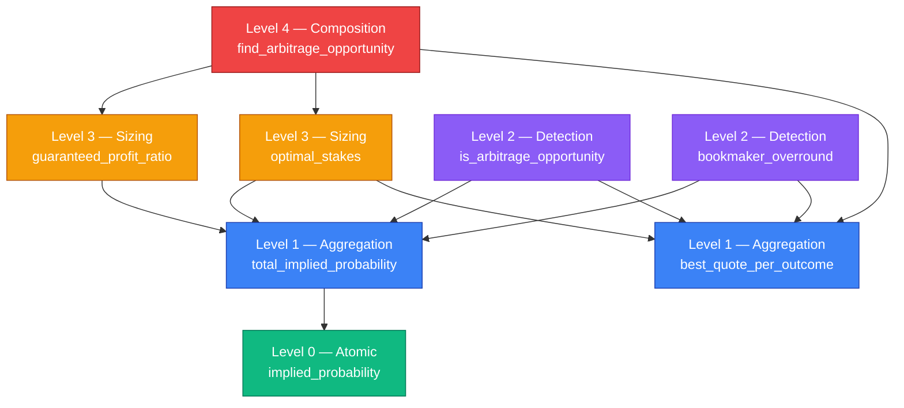

# Arbitrage Math — Design Specification

> Iteration 0 — head-to-head (h2h) tennis markets only.
> This document specifies the mathematical core of the arbitrage detection
> system: vocabulary, invariants, public API, and references.

## Goal

Detect whether a sporting event presents a guaranteed-profit opportunity by
combining the best available quotes from multiple bookmakers, and compute
how to allocate capital across outcomes to realize that profit.

The math is deliberately scoped to the simplest case: two or more
mutually exclusive outcomes, one market type (h2h / moneyline), decimal
odds only. Multi-market scenarios (spreads, totals), live in-play pricing,
and execution friction are out of scope for Iteration 0.

## Vocabulary (Ubiquitous Language)

The terms below form the shared language between the codebase, this
document, and the business domain. Every concept maps to a class or
function name in the implementation.

| Term | Symbol | Definition |
|------|--------|------------|
| **Decimal odds** | $O_i$ | The total payout multiplier offered by a bookmaker on outcome $i$. A 1-unit stake returns $O_i$ units if outcome $i$ wins (stake included). |
| **Implied probability** | $p_i = 1/O_i$ | The probability the bookmaker implicitly assigns to outcome $i$. |
| **Total implied probability** | $T = \sum_i p_i$ | Sum of implied probabilities across all outcomes of an event, using one quote per outcome. |
| **Overround** | $\omega = T - 1$ | The bookmaker's built-in margin. Positive on a single-bookmaker market; can be negative when picking best quotes across bookmakers (this is the arbitrage condition). |
| **Arbitrage opportunity** | $T < 1$ | An event where the total implied probability across best available quotes is strictly less than 1. |
| **Guaranteed profit ratio** | $r = (1/T) - 1$ | The fraction of total stake returned as profit, identical regardless of which outcome wins. |
| **Optimal stake on outcome $i$** | $s_i = S \cdot p_i / T$ | The portion of total stake $S$ to allocate on outcome $i$ to equalize payout across outcomes. |

## Invariants

These mathematical properties must hold for any valid input. They are the
properties verified by the property-based tests in `tests/test_arbitrage.py`.

### I1. Implied probability inversion

For any decimal odds $O > 1$:

$$p = \frac{1}{O}, \quad 0 < p < 1$$

Quotes with $O \leq 1$ are rejected at the model level (Pydantic constraint
`gt=Decimal(1)` on `Quote.decimal_odds`).

### I2. Arbitrage condition

An event presents an arbitrage opportunity if and only if the total implied
probability across the best quotes per outcome is strictly less than 1:

$$\text{arbitrage} \iff T < 1 \iff \sum_i \frac{1}{O_i^{\text{best}}} < 1$$

Strict inequality matters: at $T = 1$ exactly, the market is perfectly
efficient — no profit, no loss, no arbitrage.

### I3. Stake conservation

For any total stake $S$ and any event, the sum of optimal stakes equals
the total stake:

$$\sum_i s_i = \sum_i S \cdot \frac{p_i}{T} = S \cdot \frac{\sum_i p_i}{T} = S$$

### I4. Equal payout across outcomes (the arbitrage guarantee)

When stakes are allocated optimally on an arbitrage opportunity, the
payout if outcome $i$ wins is:

$$\text{payout}_i = s_i \cdot O_i = S \cdot \frac{p_i}{T} \cdot \frac{1}{p_i} = \frac{S}{T}$$

This is independent of $i$: every outcome produces the same payout, hence
the guarantee.

### I5. Profit identity

The guaranteed profit ratio equals the relative gap between unit payout
and unit stake:

$$r = \frac{S/T - S}{S} = \frac{1}{T} - 1$$

Profit is strictly positive if and only if $T < 1$ (the arbitrage condition).

## Architecture in Layers

The math is organized bottom-up, from atomic operations to business-level
composition. Each layer depends only on the layers below it.



The composition pattern ensures that bugs at higher levels can only result
from bugs at lower levels. If Level 0 is correct, fixing higher-level bugs
is a matter of fixing the composition, not the underlying math.

## Public API

All functions are pure: same input, same output, no side effects, no
hidden state. They operate on the domain models defined in `src/arb_sentinel/models.py`.

### Level 0 — Atomic

```python
def implied_probability(decimal_odds: Decimal) -> Decimal:
    """The probability a bookmaker implicitly assigns to an outcome.

    Derived as the inverse of decimal odds: a quote of 2.00 implies a 50%
    probability, a quote of 4.00 implies 25%.
    """
```

### Level 1 — Aggregation

```python
def best_quote_per_outcome(event: Event) -> dict[Outcome, Quote]:
    """For each outcome in the event, return the quote with the highest odds.

    The highest decimal odds maximize the potential payout for backing that
    outcome. Picking the best price across bookmakers is what creates
    arbitrage opportunities.

    Raises ValueError if any outcome has no quote.
    """

def total_implied_probability(quotes: Iterable[Quote]) -> Decimal:
    """Sum of implied probabilities across a collection of quotes.

    For a fair, frictionless market with all outcomes covered, this sum
    equals 1 exactly. Bookmakers build in a margin (the overround), so the
    sum on a single bookmaker is typically 1.02 to 1.10. When the sum
    across the best quotes from different bookmakers drops below 1, an
    arbitrage opportunity exists.
    """
```

### Level 2 — Detection

```python
def is_arbitrage_opportunity(event: Event) -> bool:
    """Whether this event presents an arbitrage opportunity.

    An arbitrage exists when, picking the best quote available for each
    outcome across all bookmakers, the sum of implied probabilities falls
    strictly below 1.
    """

def bookmaker_overround(event: Event) -> Decimal:
    """The margin built into the event's best quotes, as a decimal.

    The overround is the amount by which the sum of implied probabilities
    exceeds 1. A typical single-bookmaker market has an overround of 0.02
    to 0.10. A negative overround indicates an arbitrage opportunity.
    """
```

### Level 3 — Sizing

```python
def guaranteed_profit_ratio(event: Event) -> Decimal:
    """The fraction of total stake returned as profit, guaranteed regardless of outcome.

    For an arbitrage opportunity, this is what a bettor earns above their
    capital. A ratio of 0.0504 means a $1000 stake yields $50.40 of
    guaranteed profit. The ratio is positive only when arbitrage exists.
    """

def optimal_stakes(event: Event, total_stake: Decimal) -> dict[Outcome, Decimal]:
    """The stake allocation per outcome that guarantees equal payout regardless of outcome.

    Returns the distribution of capital across outcomes such that whichever
    outcome wins, the bettor receives the same payout. The formula
    proportionally weights each outcome by its implied probability divided
    by the total implied probability.

    Raises ValueError if the event is not an arbitrage opportunity.
    """
```

### Level 4 — Composition

```python
def find_arbitrage_opportunity(
    event: Event, total_stake: Decimal
) -> ArbitrageOpportunity | None:
    """The arbitrage opportunity for this event with the given capital, if any.

    Returns a complete description (best quotes, profit ratio, stake
    allocation) when arbitrage exists. Returns None when the event is
    fairly or unfavorably priced.
    """
```

The `ArbitrageOpportunity` model lives in `src/arb_sentinel/models.py`
alongside the other domain types. It is a snapshot of the detection at a
point in time: capturing best quotes and computed values is important for
logging and traceability since odds can change between detection and action.

## Worked Example

Consider a two-bookmaker tennis match:

- Pinnacle: Federer at 2.10, Nadal at 1.85
- Bet365: Federer at 2.05, Nadal at 1.90

**Step 1**: best quote per outcome.

- Federer best: 2.10 (Pinnacle)
- Nadal best: 1.90 (Bet365)

**Step 2**: total implied probability.

$$T = \frac{1}{2.10} + \frac{1}{1.90} = 0.4762 + 0.5263 = 1.0025$$

**Step 3**: arbitrage check.

$T = 1.0025 > 1$, so no arbitrage opportunity. The overround is +0.0025
(0.25%), meaning a bettor placing stakes across both outcomes would lose
about 0.25% on average.

Suppose instead Bet365 offered Nadal at 2.00:

$$T = \frac{1}{2.10} + \frac{1}{2.00} = 0.4762 + 0.5000 = 0.9762$$

Now $T < 1$, arbitrage exists. With a total stake of $1000:

- Stake on Federer: $1000 \cdot 0.4762 / 0.9762 = \$487.81$
- Stake on Nadal: $1000 \cdot 0.5000 / 0.9762 = \$512.19$

Payout if Federer wins: $487.81 \cdot 2.10 = \$1024.40$
Payout if Nadal wins: $512.19 \cdot 2.00 = \$1024.39$ (rounding)

In both cases, profit is approximately $24.40, or a guaranteed profit
ratio of $r = 1/0.9762 - 1 = 0.0244 = 2.44\%$.

## Out of Scope (Future Iterations)

These are intentionally deferred. Their omission is documented here so it
is clear that they are recognized concerns, not oversights.

| Concern | Why deferred |
|---------|--------------|
| **Slippage** (odds changing between detection and execution) | No execution in IT0 — observation only. Will require event timestamps and time-bounded validity. |
| **Partial fills** (a bookmaker accepts only part of the intended stake) | No execution in IT0. Will require modeling bookmaker stake limits. |
| **Bookmaker commissions** (e.g., Betfair Exchange charges on net winnings) | Only standard bookmakers are modeled in IT0. |
| **Currency conversion** (cross-border bookmakers) | All quotes assumed to be in the same currency in IT0. |
| **Three-way markets** (e.g., football 1X2) | The math generalizes naturally to N outcomes — only h2h (2 outcomes) is tested in IT0. |
| **Kelly Criterion sizing** (when bettor has independent probability estimates) | IT0 uses arbitrage-equal-payout sizing only. Kelly is for value betting, a different problem. |

## References

### Academic and industry sources

1. **Cortis, D. (2015).** *Expected Values and Variances in Bookmaker Payouts: A Theoretical Approach Towards Setting Limits on Odds.* Journal of Prediction Markets. — Foundational treatment of bookmaker pricing and overround.

2. **Chen, J., & Knecht, M. (2016).** *Mathematical analysis of arbitrage betting strategies.* Quantitative Finance, 16(1), 27–41. — Formalization of arbitrage detection and optimal stake allocation.

3. **Whelan, K. (2023).** *Calculating The Bookmaker's Margin: Why Bets Lose More On Average Than You Are Warned.* UCD Centre for Economic Research, Working Paper WP23/04. — Detailed treatment of overround as an estimator of expected loss; identifies the favorite-longshot bias as a source of bias in the standard formula. https://www.ucd.ie/economics/t4media/WP23_04.pdf

4. **Arbitrage Betting — Wikipedia.** https://en.wikipedia.org/wiki/Arbitrage_betting — Concise mathematical formulation with cited derivations.

### Domain-Driven Design

5. **Evans, E. (2003).** *Domain-Driven Design: Tackling Complexity in the Heart of Software.* Addison-Wesley. — Source of the "Ubiquitous Language" and "Value Object" patterns applied throughout this design.

### Industry conventions

6. **The Odds API documentation.** https://the-odds-api.com/liveapi/guides/v4/ — Defines the event / bookmaker / market / outcome taxonomy used by most modern odds aggregators. Our `Event` model corresponds to their `event`, with the simplification that we model only the h2h market type in IT0.

7. **Pinnacle Sports Insights — Understanding Margin.** https://www.pinnacle.com/en/betting-articles/Betting-Strategy/the-real-cost-of-the-bookmakers-margin/Q72YQH8WUCFGYE3D — Industry reference on overround as a measure of bookmaker margin, with worked examples.

### Software design

8. **Martin, R. C. (2008).** *Clean Code: A Handbook of Agile Software Craftsmanship.* Prentice Hall. — Source of the "code reads like business prose" principle applied to function naming and structure in this design.

## Status

This specification corresponds to Iteration 0. It will be revised when:

- Additional market types are introduced (a `Market` entity will mediate between `Event` and outcomes)
- Execution friction is modeled (slippage, partial fills, commissions)
- Three-or-more-outcome events are tested

Revisions are tracked in the project [ROADMAP](../../ROADMAP.md) decision log.
