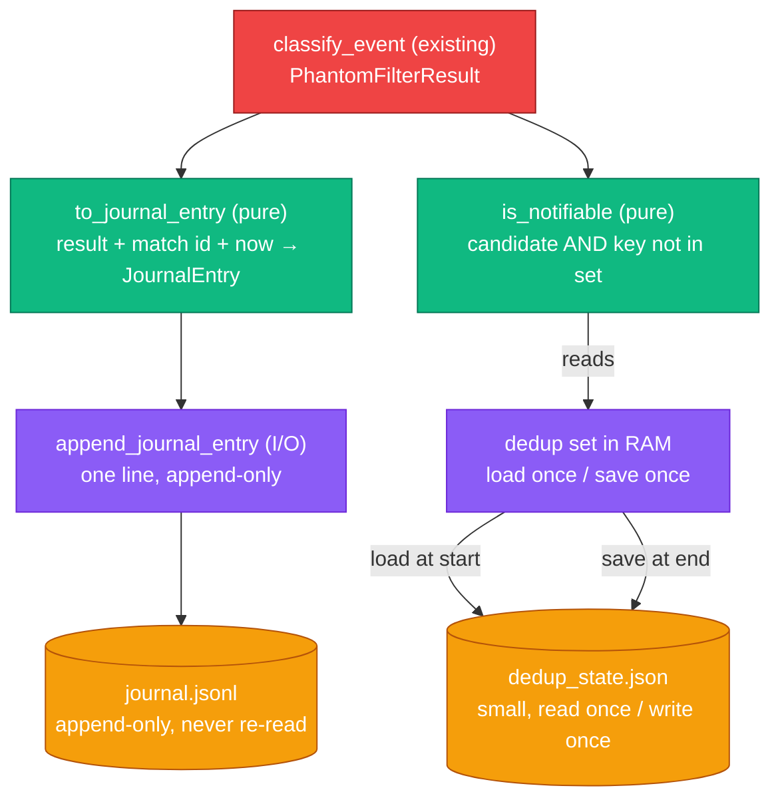

# Detection Journal & Notification Dedup — Design Specification

> Iteration 1 — persist every classified detection to an append-only JSONL journal,
> and keep a small dedup state so each opportunity is notified at most once.

## Goal

Give the continuous poller a memory. Each cycle classifies events (via the phantom
filter) and must:

1. **Record every classification** — candidate, phantom, no_arbitrage, low_confidence —
   one line per detection in an append-only JSONL journal, so the iteration's question
   ("how often do clean arbitrages surface, and what fraction of raw detections are
   phantoms?") is answerable from real data.
2. **Notify each opportunity at most once** — a small dedup state remembers which
   candidates have already been notified, so re-observing the same match on the next
   cycle does not re-fire the webhook.

The journal is the **exhaustive record** (written every cycle, never re-read). The dedup
state is the **notification memory** (read once at start, written once at end). Keeping
them separate is deliberate: the journal grows without bound and is only ever appended;
the dedup state stays small and is the only thing held in RAM and rewritten.

This spec covers persistence and the dedup decision only. The webhook *delivery* itself
(the HTTP POST, the message format) is a separate piece (`docs/design/notification.md`,
to follow); here we specify *whether* to notify, not *how*.

## Vocabulary (Ubiquitous Language)

| Term | Definition |
|------|------------|
| **Journal** | An append-only JSONL file. One line per classified detection, written every cycle for every event, regardless of classification. The complete, ordered history. Never read back by the application. |
| **Journal entry** | One line of the journal: a frozen Pydantic model serialized with `model_dump_json()`. Carries a UTC timestamp, the event identity, the classification, the reason, the book counts, the raw/clean totals, and (for a candidate) the opportunity. |
| **Dedup key** | The string that decides whether two detections are "the same opportunity". For IT1 it is **the event identity** — the event's `description` (e.g. `"Matteo Arnaldi vs Raphael Collignon"`). One notification per match, ever. |
| **Dedup state** | The set of dedup keys already notified. Persisted as a small JSON file, loaded once into an in-memory `set[str]` at cycle start, consulted and updated in RAM during the cycle, and rewritten once at cycle end. |
| **Notifiable** | A detection that (a) is classified `candidate`, and (b) whose dedup key is not already in the dedup state. Only notifiable detections trigger the webhook; all detections are journaled. |

Note: "journal", never "database". The journal is appended, not queried. The signal that
unlocks a real database is the need to *query* this history (aggregate margins, backtest
replay, dashboards) — IT2/IT3 territory (see ROADMAP decision log, 2026-06-06).

## Invariants

These properties must hold for any valid input. They are the properties verified by the
tests in `tests/test_journal.py`.

### J1. Every detection is journaled exactly once per cycle

For each event classified in a cycle, exactly one line is appended to the journal,
whatever its classification. The journal line count after a cycle increases by exactly
the number of events classified. No classification is skipped (no_arbitrage included),
and none is written twice.

### J2. The journal is append-only

A cycle only ever appends to the journal; it never reads, rewrites, or truncates it.
Earlier lines are immutable. (This is what lets the journal grow without becoming a
per-cycle cost.)

### J3. Round-trip fidelity (Decimal preserved exactly)

Every `Decimal` field is serialized as a JSON **string**, never a float. Reading a
journal line back and re-validating it through the model yields a value equal to the
original — no precision loss. Concretely: `JournalEntry.model_validate_json(line)`
reproduces every `Decimal` exactly.

### J4. A dedup key is notified at most once across cycles

Once a dedup key has been notified and recorded in the dedup state, no later cycle
notifies it again, even if the same event is re-observed as a candidate. (The detection
is still journaled every time — J1 — only the *notification* is suppressed.)

### J5. Dedup state I/O is bounded per cycle

The dedup state is read exactly once (at cycle start) and written exactly once (at cycle
end), regardless of how many events are processed. During the cycle the membership test
and insertion happen against the in-memory set — the file is not touched per event.

### J6. Journal and notification are independent

Journaling never depends on the dedup state, and the dedup decision never depends on the
journal's contents. A detection is journaled whether or not it is notified; the notify
decision reads only the in-memory dedup set, never the journal. (This is what makes the
exhaustive-record / deduplicated-notification split clean.)

## Architecture

I/O is isolated, the decision is pure — mirroring the rest of the codebase.



**Separation of concerns**:

- **Pure** (`to_journal_entry`, `is_notifiable`, `dedup_key`): no I/O, no clock reads
  passed in rather than called inside, deterministic, property-testable.
- **I/O** (`append_journal_entry`, `load_dedup_state`, `save_dedup_state`): the only
  functions that touch the filesystem. Thin wrappers, no business logic.
- **Models** (`JournalEntry`): frozen, logic-free, define the on-disk schema.

Where it lives: a new module `src/arb_sentinel/journal.py` holds the journal +
dedup functions; `JournalEntry` joins the other models in `models.py`. The cycle
orchestration (loading state at start, the per-event append + notify decision, saving
state at end) is wired in the entry point / cycle script, not inside these functions.

**The clock is injected, not called.** `to_journal_entry` takes the timestamp as a
parameter (`detected_at: datetime`) rather than calling `datetime.now()` internally, so
it stays pure and the tests can pin a fixed timestamp. The caller passes
`datetime.now(UTC)`.

## Design Principles

This subsystem is deliberately built as a **Functional Core, Imperative Shell**, and the
choice is worth stating because it determines which SOLID principles apply and which are
intentionally *not* invoked.

- **Single Responsibility (the load-bearing one).** Three responsibilities are split:
  *deciding* what to record and whether to notify (pure functions), *performing* the
  file I/O (thin wrappers), and *describing* the on-disk shape (`JournalEntry`). The
  pure/I/O separation is SRP applied, and it is where the design earns its keep.

- **Dependency Inversion — by removing the dependency, not abstracting it.** The
  high-level decisions (`is_notifiable`, `to_journal_entry`, `dedup_key`) depend on
  *nothing* from the I/O layer; they are pure. The low-level I/O is called only from the
  cycle orchestration (the shell). There is no dependency from core to shell to invert —
  it has been eliminated. A pure function has nothing to mock and nothing to inject. The
  only inversion present is the minimal, correct kind: the `Path` and the timestamp are
  **parameters supplied by the caller**, so the I/O does not decide its own location and
  the entry builder does not read its own clock.

- **Open/Closed — earned, not speculative.** The one seam deliberately placed is
  `dedup_key`, isolated as a function because the roadmap names a concrete future change
  (a key that folds in a price fingerprint, IT2). No `JournalWriter` / `Repository` /
  `Clock` interface is introduced, because there is exactly **one** concrete
  implementation of each today. Adding an abstraction now would be the speculative
  complexity that `earn complexity` forbids.

- **Liskov / Interface Segregation — not applicable, by design.** There is no inheritance
  hierarchy and no interface, so neither principle has anything to govern. Their *spirit*
  (no client depends on more than it needs) is honored through narrow function signatures
  — each function takes exactly its inputs, never a broad "context" object.

**The decisive test**, reusable for every future piece: *do I have, today, two concrete
implementations of this thing?* One JSONL writer, one clock, one dedup key → the
interface is premature; the parameterized concrete function suffices. When a second
implementation actually arrives (a database writer in a later iteration), the abstraction
is introduced *then* — and `dedup_key`, already isolated, is the proof that seams are
placed when the need is named, not before.

No new dependencies follow from any of this: Functional Core / Imperative Shell is a way
of organizing, not a library, and it is the organization that *minimizes* dependencies by
refusing injection frameworks. The journal uses only `json`, `pathlib`, `datetime`
(stdlib) and the already-present `pydantic`.

## Public API

```python
class JournalEntry(BaseModel):
    """One classified detection, at a point in time. Serialized as one JSONL line.

    Frozen and logic-free. Decimal fields serialize to JSON strings (never floats),
    so the on-disk record preserves the exact computed values.
    """
    model_config = ConfigDict(frozen=True)

    detected_at: datetime          # UTC; injected by the caller, not read internally
    match_id: str                  # the dedup key — the event description
    classification: Literal["candidate", "phantom", "no_arbitrage", "low_confidence"]
    reason: str
    book_counts: dict[str, int]    # outcome name -> book count (string keys for JSON)
    raw_total_implied_probability: Decimal
    clean_total_implied_probability: Decimal | None
    opportunity: ArbitrageOpportunity | None


def dedup_key(match_id: str) -> str:
    """The dedup key for a detection. For IT1, the match identity (match_id) itself.

    Pure. Isolating it in one function means the IT2 refinement (key that also folds in
    the best-quote fingerprint, so a materially better price re-notifies) is a one-place
    change, not a scatter across the cycle code.
    """


def to_journal_entry(
    result: PhantomFilterResult,
    match_id: str,
    detected_at: datetime,
) -> JournalEntry:
    """Project a classification result into a journal entry. Pure.

    book_counts is converted from {Outcome: int} to {str: int} (outcome name keys) so it
    serializes cleanly to JSON. detected_at is passed in (kept pure); the caller supplies
    datetime.now(UTC).
    """


def is_notifiable(result: PhantomFilterResult, key: str, already_notified: set[str]) -> bool:
    """Whether this detection should fire a notification. Pure.

    True iff the result is classified "candidate" AND key is not in already_notified.
    Reads only the in-memory set — never the journal, never the disk.
    """


def append_journal_entry(entry: JournalEntry, journal_path: Path) -> None:
    """Append one entry as a single line to the journal file. I/O.

    Opens in append mode, writes entry.model_dump_json() + "\\n". Never reads or
    rewrites existing content. Creates the file (and parents) if absent.
    """


def load_dedup_state(state_path: Path) -> set[str]:
    """Load the set of already-notified dedup keys. I/O.

    Returns an empty set if the file does not exist (first run). Read exactly once per
    cycle, at start.
    """


def save_dedup_state(keys: set[str], state_path: Path) -> None:
    """Persist the set of notified dedup keys. I/O.

    Written exactly once per cycle, at end. Creates the file (and parents) if absent.
    """
```

### Cycle wiring (orchestration, not in these functions)

The entry point composes them, once per cycle:

```
notified = load_dedup_state(state_path)          # J5: read once
webhook_url = ...                                 # loaded from DISCORD_WEBHOOK_URL at cycle start
now = datetime.now(UTC)
for event in events:
    result = classify_event(event, ...)          # existing phantom filter
    key = dedup_key(event.description)
    append_journal_entry(                         # J1, J2: always, append-only
        to_journal_entry(result, event.description, now), journal_path
    )
    if is_notifiable(result, key, notified):       # J4, J6: reads only the set
        if send_notification(result, webhook_url): # deliver; True iff delivered (notification.md)
            notified.add(key)                       # remember in RAM, only on a delivered notification
save_dedup_state(notified, state_path)            # J5: write once
```

## Worked Example

Two cycles, 20 minutes apart, observing the same tournament. The Arnaldi vs Collignon
match presents a clean ~1.85% candidate both times; another match is no_arbitrage.

**Cycle 1** — dedup state file does not exist yet.

- `load_dedup_state` → `set()` (empty, first run).
- Arnaldi vs Collignon → `candidate`. Journal appended (line 1). `is_notifiable` → key
  `"Matteo Arnaldi vs Raphael Collignon"` not in set → **True** → webhook fires, key
  added to the in-memory set.
- The other match → `no_arbitrage`. Journal appended (line 2). `is_notifiable` → not a
  candidate → **False** → no webhook. (Still journaled — J1.)
- `save_dedup_state` → writes `{"Matteo Arnaldi vs Raphael Collignon"}`.

Journal now has 2 lines; dedup state has 1 key.

**Cycle 2** — 20 minutes later, same two matches, same classifications.

- `load_dedup_state` → `{"Matteo Arnaldi vs Raphael Collignon"}`.
- Arnaldi vs Collignon → `candidate` again. Journal appended (line 3). `is_notifiable` →
  key **is** in the set → **False** → no webhook. The candidate is recorded a second
  time in the journal (J1) but **not** re-notified (J4).
- The other match → `no_arbitrage`. Journal appended (line 4). Not notifiable.
- `save_dedup_state` → writes the same one key.

Journal now has 4 lines (the full history, including the repeat candidate); dedup state
still has 1 key; the user received exactly **one** Discord ping for the match. This is
the exhaustive-record / deduplicated-notification split: the analysis later can see the
candidate persisted across two cycles, while the human was pinged once.

**A journal line (illustrative shape).** Decimals are strings; this is one line of
`journal.jsonl` (wrapped here for readability — it is a single line on disk):

```json
{"detected_at":"2026-06-20T18:24:05Z","match_id":"Matteo Arnaldi vs Raphael Collignon",
 "classification":"candidate","reason":"Clean arbitrage at 0.0185 profit ratio.",
 "book_counts":{"Matteo Arnaldi":15,"Raphael Collignon":15},
 "raw_total_implied_probability":"0.7771...","clean_total_implied_probability":"0.9818...",
 "opportunity":{ ... ArbitrageOpportunity, all Decimals as strings ... }}
```

## Out of Scope (Future Iterations)

| Concern | Why deferred |
|---------|--------------|
| **Querying the journal** (aggregate margins, filter by date/margin, replay) | The journal is append-only for IT1. Querying is the signal that unlocks a real database (Postgres / TimescaleDB), IT2/IT3. The JSONL → DB import is mechanical because each line is already a Pydantic model. |
| **Dedup key that folds in the price** (re-notify when a *materially better* price appears on a match already seen) | IT1 accepts missing a second opportunity on the same match, in exchange for zero spam. `dedup_key` is isolated precisely so this becomes a one-place change. Requires defining "materially better". |
| **Journal rotation / compaction** | The journal grows without bound, but at windowed-poll cadence on one tournament the growth is slow; rotation is premature. Revisit if file size becomes an operational problem. |
| **Dedup state expiry / TTL** | The set grows by at most one key per distinct notified match. Over a season this stays small; a time-windowed eviction (forget keys older than N days) is a refinement only needed if the set grows enough to matter. |
| **Concurrent writers** | One poller, one writer. Append-mode writes from a single process need no locking. Multiple writers would require coordination — not an IT1 concern. |
| **Crash-safety / atomic state write** | A crash mid-write of the small state file could in principle lose the last cycle's notified keys (worst case: one duplicate notification on the next run). Acceptable for IT1; an atomic write-then-rename is a cheap later hardening if it ever bites. |

## References

1. **JSON Lines specification.** https://jsonlines.org/ — The one-JSON-object-per-line format used for the journal: simple to append, simple to read line-by-line, trivial to import into a database later.
2. **Pydantic v2 — JSON serialization.** https://docs.pydantic.dev/latest/concepts/serialization/ — `model_dump_json()` / `model_validate_json()`; `Decimal` serializes to a JSON string by default, which is what gives J3 (round-trip fidelity) for free.
3. **arb-sentinel ROADMAP decision log** — "File-based persistence (JSONL); database deferred" (2026-06-06) — the earn-complexity rationale this spec implements.
4. `docs/design/phantom-filtering.md` — produces the `PhantomFilterResult` this journal records.
5. **Evans, E. (2003).** *Domain-Driven Design.* Addison-Wesley. — "Value Object" pattern applied to `JournalEntry`.

## Status

This specification corresponds to Iteration 1. It will be revised when:

- The journal needs to be *queried* (a database replaces the file)
- The dedup key folds in a price fingerprint (re-notification on materially better prices)
- Journal rotation or dedup-state expiry is introduced

Revisions are tracked in the project [ROADMAP](../../ROADMAP.md) decision log.
