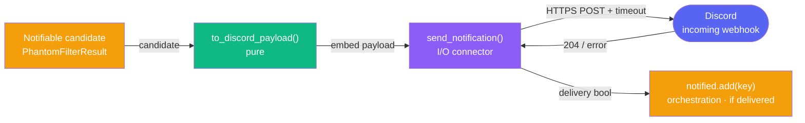

# Discord Notification Delivery — Design Specification

> Iteration 1 — deliver a notifiable arbitrage candidate to Discord via an incoming
> webhook, such that a delivery failure never aborts the cycle and never prematurely
> records the dedup key, and the message itself is a pure, testable projection.

## Goal

The journal spec (`docs/design/journal.md`) decided *whether* to notify: a detection is
notifiable when it is classified `candidate` **and** its dedup key has not already been
notified (`is_notifiable`). This spec covers *how* that notification is delivered.

Concretely, for each notifiable candidate the poller must:

1. **Render** the candidate into a Discord message — the match, the guaranteed profit
   ratio, and the best quote (odds + bookmaker + book count) per outcome — as a pure
   projection of the detection, so the format is testable without a network.
2. **Deliver** it to Discord over an incoming webhook (one HTTP `POST`), reporting
   whether the delivery succeeded, and **never raising on a delivery failure** so a single
   failed webhook cannot stop the cycle.

The split mirrors the rest of the codebase: a pure formatter and a thin I/O sender. One
channel (Discord) is in scope for IT1; the seam for a second channel is named, not built
(see Design Principles).

### Relationship to the journal spec

`journal.md` sketches the per-cycle wiring as `send_notification(result)` followed by an
unconditional `notified.add(key)`, with the ordering chosen deliberately so a failed send
cannot mark an opportunity as notified. This spec makes that ordering *operative* by
defining `send_notification` to **return a delivery-success boolean**, so the recording of
the dedup key becomes conditional on a delivered notification:

```text
if is_notifiable(result, key, notified):       # journal.md — candidate AND key unseen
    if send_notification(result, webhook_url):  # this spec — deliver; True iff delivered
        notified.add(key)                        # record only on a delivered notification
```

This is a one-line refinement of `journal.md`'s cycle pseudo-code (wrap the `.add` in the
delivery check; thread `webhook_url`). Per ADR-0001, that edit to an existing spec is a
trip-wire requiring review before it is applied.

## Vocabulary (Ubiquitous Language)

| Term | Definition |
|------|------------|
| **Notification** | A single Discord message delivered for one notifiable candidate. At most one per match, ever (the dedup guarantee lives in `journal.md`). |
| **Notifiable candidate** | A `PhantomFilterResult` with `classification == "candidate"` whose dedup key is not already notified. Defined in `journal.md`; this spec is only ever invoked for one, and does not re-check notifiability. |
| **Payload** | The exact JSON body POSTed to the webhook. For IT1 it is a single Discord **embed**. A plain `dict`, not a domain model (see Design Principles). |
| **Embed** | Discord's structured-message object: a title, an accent color, key/value fields, and a footer. The candidate is rendered as one embed. |
| **Webhook URL** | The Discord-issued URL `https://discord.com/api/webhooks/{id}/{token}`. The token is part of the URL, so the **whole URL is a secret** — anyone holding it can post to the channel. |
| **Delivery success / failure** | Success is a 2xx response (Discord returns `204 No Content`). Failure is any non-2xx response, a timeout, or a transport error. |

Note: "notification", not "alert pipeline". There is one channel, one process, one message
per candidate. The signal that unlocks a notifier abstraction is a *second channel*; the
signal that unlocks retry/queue machinery is a *delivery guarantee requirement* — neither
is present in IT1 (see Out of Scope).

## Invariants

These properties must hold for any valid input. They are the properties verified by the
tests in `tests/test_notification.py`.

### N1. The dedup key is recorded only after a delivered notification

When a detection is notifiable, its dedup key is added to the dedup state **iff**
`send_notification` returns `True`. A failed delivery leaves the key unrecorded, so the
candidate is re-evaluated — and retried — on the next cycle. (The recording itself happens
in the cycle orchestration, via the `if send_notification(...): notified.add(key)` form;
this invariant constrains that wiring.)

### N2. A delivery failure never propagates

`send_notification` catches every network and HTTP failure — timeout, transport error, and
any non-2xx response, **including Discord 429 (rate limit) and 5xx** — and returns `False`.
It never raises for a delivery failure. One failed webhook cannot abort the cycle or
prevent the remaining events from being journaled and processed.

### N3. The payload is a pure projection of the detection

`to_discord_payload` is a pure function of the `PhantomFilterResult`: deterministic, no
I/O, no clock read. The same result always yields the same payload. (Determinism relies on
the stable outcome order carried by the event through the detection pipeline.)

### N4. Decimal never float on the wire

Every value derived from odds or margin — the guaranteed profit ratio, every decimal odds
— is formatted to a **string** via `Decimal` quantization. The payload contains no float.
This extends the project's Decimal-never-float rule to the wire, exactly as `journal.md`'s
J3 extends it to disk. (Book counts are integers, not money/odds, and remain integers.)

### N5. The webhook URL never leaks

The URL is never placed in the payload, never written to the journal, and never included
in any diagnostic emitted on failure. The testable form of this invariant is that the URL
string never appears in the serialized payload. The discipline of not logging it extends
to any failure diagnostic.

### N6. Only candidates are rendered

`to_discord_payload`'s precondition is `result.classification == "candidate"` and
`result.opportunity is not None`. This is guaranteed by the caller, since only notifiable
(therefore candidate) detections reach delivery. The formatter does not attempt to render
`phantom`, `no_arbitrage`, or `low_confidence` results.

## Architecture

The split mirrors the rest of the codebase: I/O is isolated, formatting is pure. Discord is
an external service, reached by one outbound HTTPS POST.



`to_discord_payload` is the pure core: it turns a candidate into the exact JSON body, with
no I/O and no clock read, so the message format is property-testable on its own.
`send_notification` is the I/O connector — the only function that touches the network. It
builds the payload, POSTs it to Discord with an explicit timeout, and swallows any delivery
error into a boolean. The payload is a plain `dict`, not a frozen model: it is outbound,
write-only data we construct from already-validated domain objects, so there is nothing to
validate and nothing to round-trip — in contrast to `JournalEntry` (our on-disk schema) and
the Odds API schemas (which validate untrusted inbound data).

Both functions live in a new module `src/arb_sentinel/notification.py`. The webhook URL is
injected as a parameter rather than read from the environment inside the function, so the
I/O wrapper stays thin and does not decide its own configuration — mirroring how `api_key`
is threaded into `fetch_events`. The cycle orchestration (loading `DISCORD_WEBHOOK_URL` from
`.env`, and the `if send_notification(...): notified.add(key)` wiring) lives in the entry
point, not in these functions, exactly as the journal's cycle wiring does.

## Public API

```python
# Module constants (tunable; comment states the why)
WEBHOOK_TIMEOUT_SECONDS = 10.0   # bound a stalled POST so it cannot hang a cycle
CANDIDATE_EMBED_COLOR = 0x10B981  # the project's emerald: green = clean candidate


def to_discord_payload(result: PhantomFilterResult) -> dict:
    """Render a notifiable candidate as the Discord webhook JSON body. Pure.

    Precondition (N6): result.classification == "candidate" and result.opportunity is not
    None — guaranteed by the caller, since only notifiable detections reach delivery.

    Returns a single Discord embed: the match as title, the guaranteed profit ratio as a
    quantized percentage, and one field per outcome carrying the best odds, its bookmaker,
    and the book count. All Decimal values are formatted to strings (N4); no clock is read
    (N3); the webhook URL is never present (N5).
    """


def send_notification(result: PhantomFilterResult, webhook_url: str) -> bool:
    """Deliver the notification for a candidate to Discord. I/O. Returns delivery success.

    Builds the payload via to_discord_payload and POSTs it with WEBHOOK_TIMEOUT_SECONDS.
    Returns True on a 2xx response (Discord returns 204). Returns False on any timeout,
    transport error, or non-2xx response — including 429 (rate limit) and 5xx — and never
    raises for a delivery failure (N2). The webhook URL is never logged (N5).
    """
```

**Failure handling shape.** `httpx.HTTPError` is the common base of `HTTPStatusError`
(raised by `raise_for_status` on a non-2xx response), `TimeoutException`, and the transport
errors, so a single `except httpx.HTTPError` clause catches timeout, transport failure, and
non-2xx alike — each mapped to `return False`. Discord's 429 carries a `retry_after`; IT1
ignores it (the failure is simply retried next cycle), so no body parsing is needed.

**Payload shape (one embed).** The body is `{"embeds": [embed]}`, where the embed sets
`title`, `description` (the headline margin), `color`, a list of `fields` (one per
outcome), and a static `footer`. No `timestamp` is set: setting one would require a clock
read and break the formatter's purity, Discord already stamps the message with its receipt
time, and the *precise* detection time is the journal's responsibility, not the alert's.

## Worked Example

The Arnaldi vs Collignon candidate from the journal's worked example surfaces as a clean
arbitrage. Best quotes (post phantom-filter): Arnaldi 2.04 @ Pinnacle, Collignon 2.04 @
Betfair, 15 books on each outcome; the resulting guaranteed margin is 2.00%.

`to_discord_payload(result)` produces (illustrative — Decimals are strings, no float):

```json
{
  "embeds": [
    {
      "title": "Matteo Arnaldi vs Raphael Collignon",
      "description": "Clean arbitrage — **2.00%** guaranteed margin",
      "color": 1096065,
      "fields": [
        { "name": "Matteo Arnaldi",   "value": "2.04 @ Pinnacle · 15 books", "inline": true },
        { "name": "Raphael Collignon", "value": "2.04 @ Betfair · 15 books",  "inline": true }
      ],
      "footer": { "text": "arb-sentinel" }
    }
  ]
}
```

(`color` 1096065 is `0x10B981`, the project's emerald.)

`send_notification(result, webhook_url)` POSTs this body:

- **Discord returns 204** → `send_notification` returns `True` → the orchestration runs
  `notified.add(key)`. The candidate is recorded as notified; the next cycle will not
  re-fire it (J4, journal.md).
- **Discord returns 429 / 503, or the POST times out** → `send_notification` catches it and
  returns `False` → `notified.add(key)` does **not** run. The candidate stays unrecorded
  and is retried on the next cycle (N1). The cycle continues to the remaining events
  uninterrupted (N2).

The candidate is journaled every cycle regardless (J1, journal.md); only the *notification*
is gated on delivery.

## Out of Scope (Future Iterations)

| Concern | Why deferred |
|---------|--------------|
| **A second channel / `Notifier` abstraction** | One channel (Discord) in IT1. The Strategy / notifier protocol is introduced when a second concrete channel exists — the seam (`to_discord_payload` / `send_notification`, named per-channel) is placed so this is a clean lift, not a scatter. |
| **In-cycle retry / backoff / `retry_after` parsing** | The natural retry is the next cycle; at ~15–25 min cadence with a handful of pings, Discord's per-webhook rate limit (≈5 requests / 2 s) is never approached. Backoff and a delivery queue are unlocked by a delivery *guarantee* requirement. |
| **Embed limit guarding / truncation** | The embed is far below Discord's limits (title ≤ 256, field value ≤ 1024, ≤ 25 fields, ≤ 6000 total). Tennis match and bookmaker names do not approach them. Truncation is added only if a future, larger payload risks the limits. |
| **`username` / `avatar_url` per-message overrides** | Cosmetic. The webhook's configured name and avatar suffice for IT1. |
| **Stake breakdown in the message** (`optimal_stakes`, `total_stake`, absolute profit) | Execution-adjacent — IT2+. The journal already records the full `ArbitrageOpportunity`, so the data is preserved for later analysis without putting it in the alert. |
| **Threads** (`thread_id` / `thread_name`) | Single channel, no threads. |
| **Exactly-once delivery** | IT1 accepts **at-least-once**: a transient failure followed by a later success could, rarely, double-notify. This is symmetric to `journal.md`'s crash-safety note and is the deliberate trade for never silently dropping an alert. |

## References

1. **Discord — Execute Webhook** (`resources/webhook`). https://discord.com/developers/docs/resources/webhook — The `POST` contract: the body must provide at least one of `content`, `embeds`, `components`, `file`, or `poll`; success is `204 No Content` (or a message object with `?wait=true`).
2. **Discord — Embed object and limits.** Title ≤ 256, description ≤ 4096, ≤ 25 fields (name ≤ 256, value ≤ 1024), footer ≤ 2048, ≤ 6000 characters total across a message's embeds, ≤ 10 embeds — all far above what this alert uses.
3. **Discord — Rate Limits.** https://discord.com/developers/docs/topics/rate-limits — A 429 returns a JSON body with `retry_after` and a `Retry-After` header; per-webhook limits are well outside IT1's cadence. IT1 treats a 429 as an ordinary delivery failure.
4. **`httpx` — timeouts and exception hierarchy.** A float `timeout` bounds connect / read / write / pool; `httpx.HTTPError` is the base of `HTTPStatusError`, `TimeoutException`, and the transport errors, so one `except` covers all delivery failures.
5. `docs/design/journal.md` — defines `is_notifiable` and the cycle wiring this spec's `send_notification` slots into; the dedup-ordering rationale this spec makes operative.
6. `docs/design/phantom-filtering.md` — produces the candidate `PhantomFilterResult` / `ArbitrageOpportunity` rendered here.
7. **arb-sentinel ROADMAP decision log** — "Iteration 1 scope finalized" and the secret-as-env-var decision (2026-06-06); "Journal persistence: Functional Core / Imperative Shell, no writer abstraction" (2026-06-20) — the rationale this spec extends to the notification channel.

## Status

This specification corresponds to Iteration 1. It will be revised when:

- A **second notification channel** is added (a `Notifier` protocol / Strategy is introduced then)
- A **delivery guarantee** is required (retry / backoff / queue)
- The message format grows enough to need **embed limit guarding**

Revisions are tracked in the project [ROADMAP](../../ROADMAP.md) decision log.