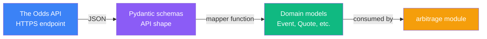

# Odds API Integration — Design Specification

> Iteration 0 — fetch tennis events with h2h odds from The Odds API and
> map them to the domain models defined in `src/arb_sentinel/models.py`.
>
> This document specifies the integration layer between The Odds API and
> the arbitrage math module: vocabulary mapping, architecture, public API,
> and references.

## Goal

Retrieve current odds for a chosen tennis tournament from The Odds API,
validate and normalize the response, and produce a list of `Event`
instances ready for arbitrage detection.

The integration is deliberately scoped to a single source (The Odds API),
a single market type (h2h / moneyline), and a single output (in-memory
`list[Event]`). Multi-source aggregation, rate-limiting strategy, retries,
and caching are out of scope for Iteration 0.

## Vocabulary

The Odds API uses a slightly different taxonomy than our domain model.
The mapping must be unambiguous.

| The Odds API term | Our domain term | Notes |
|-------------------|-----------------|-------|
| **Sport** (`sport_key`) | (implicit, filtered upstream) | E.g., `tennis_atp_french_open`. Not stored in our models for IT0. |
| **Event** | `Event` | A single match. The API event maps directly to our `Event`. |
| **Bookmaker** (`bookmakers[]`) | `Bookmaker` | API uses `key` (slug) and `title` (display name). Our `Bookmaker.name` is the `title`. |
| **Market** (`markets[]`) | (implicit, h2h only in IT0) | A market type within an event. We keep only `market.key == "h2h"`. |
| **Outcome** (`outcomes[]`) | `Outcome` + `Quote` | API outcome is a pair (name, price). Our domain splits this into an `Outcome` (the result) and a `Quote` (the bookmaker's offered price on it). |
| **Price** | `Quote.decimal_odds` | The API returns a float; we coerce to `Decimal`. |
| **Lay market** (`h2h_lay`) | (filtered out) | Exchange-specific reverse-bet market. Different mathematical contract. See *Out of Scope*. |

## Architecture

The integration lives in a single module `src/arb_sentinel/odds_api.py`
with three responsibilities: parsing, mapping, and fetching.



**Separation of concerns**:

- **API schemas** (`OddsApiEvent`, `OddsApiBookmaker`, `OddsApiMarket`,
  `OddsApiOutcome`): mirror the JSON shape returned by The Odds API.
  Pydantic validates the structure at parse time.
- **Mapper function** (`to_domain_event`): converts API schemas to domain
  models. Applies the `h2h` filter and any structural normalization.
- **Client function** (`fetch_events`): wraps the HTTP call, parses the
  response into API schemas, then maps to domain models.

The split is intentional: if The Odds API changes its JSON format, only
schemas and mapper need to change — the domain stays untouched. The
domain remains source-agnostic.

## Public API

```python
def fetch_events(sport_key: str, api_key: str) -> list[Event]:
    """Fetch all events for the given tournament from The Odds API.

    Returns a list of domain Event objects ready for arbitrage detection.
    Each event has exactly the h2h market quotes from all bookmakers that
    cover it. Bookmakers offering only non-h2h markets are excluded.

    Raises httpx.HTTPStatusError on non-2xx responses (rate limit, invalid
    key, etc.). Errors are not caught here — callers decide how to handle.
    """


def to_domain_event(api_event: OddsApiEvent) -> Event:
    """Map a single API event to a domain Event.

    Filters bookmaker markets to keep only `h2h`. Skips bookmakers that
    do not offer h2h. Raises ValueError if:

    - The event has already started (in-play). In-play odds change
      constantly and bookmakers update at different speeds, producing
      apparent arbitrages that are not actually exploitable.
    - The resulting event has fewer than 2 quotes (insufficient for
      arbitrage analysis).
    """
```

## Mapping Rules

For each event returned by the API:

1. **Sport-level fields** (`sport_key`, `sport_title`, `home_team`,
   `away_team`, `commence_time`, `id`) are not stored in IT0. The
   `description` field of the domain `Event` is composed from
   `home_team` and `away_team`.

2. **Bookmakers**: each API bookmaker becomes a domain `Bookmaker`
   whose `name` is the bookmaker's `title` (e.g., `"Pinnacle"`).

3. **Outcomes**: each unique `outcome.name` across all bookmakers becomes
   a domain `Outcome`. Names are taken verbatim from the API.

4. **Quotes**: each API outcome (within `market.key == "h2h"`) becomes a
   domain `Quote` linking the corresponding `Outcome` and `Bookmaker`.
   The `price` field is coerced to `Decimal` via Pydantic.

5. **Non-h2h markets** (`h2h_lay`, future market types) are silently
   dropped. They represent different financial contracts and are not
   directly comparable to h2h quotes for arbitrage detection.

6. **Bookmakers without h2h**: a bookmaker that offers only `h2h_lay`
   (or no h2h market at all) is excluded entirely from the event.

## Worked Example

Given the API response for an Arnaldi vs. Collignon match:

```json
{
  "home_team": "Matteo Arnaldi",
  "away_team": "Raphael Collignon",
  "bookmakers": [
    {
      "title": "Pinnacle",
      "markets": [
        {
          "key": "h2h",
          "outcomes": [
            {"name": "Matteo Arnaldi", "price": 3.19},
            {"name": "Raphael Collignon", "price": 1.39}
          ]
        }
      ]
    },
    {
      "title": "Betfair",
      "markets": [
        {"key": "h2h",     "outcomes": [...]},
        {"key": "h2h_lay", "outcomes": [...]}
      ]
    }
  ]
}
```

The mapper produces:

- `Event.description`: `"Matteo Arnaldi vs Raphael Collignon"`
- `Event.outcomes`: `[Outcome(name="Matteo Arnaldi"), Outcome(name="Raphael Collignon")]`
- `Event.quotes`: one `Quote` per bookmaker × outcome from the h2h market only.
  Betfair contributes its h2h quotes; its h2h_lay outcomes are dropped.

## Out of Scope (Future Iterations)

| Concern | Why deferred |
|---------|--------------|
| **Lay markets** (`h2h_lay` from Betfair, Matchbook) | Lay bets are a different financial contract: laying at odds *O* commits *(O-1) × stake* of liability for a gain of *stake*. Mixing lay and back in arbitrage math requires extending the model. |
| **Bookmaker commissions** (Betfair 5% on net winnings, etc.) | Already deferred in the arbitrage math spec. Commissions would change the profit calculation when exchanges are involved. |
| **Liquidity / partial fills** | The API price reflects the best available offer, but the size at that price may be limited. IT0 is observation-only, so this is not exercised. |
| **In-play / live odds detection** | IT0 filters out events whose `commence_time` has passed. In-play odds change in real time and bookmakers update at different latencies, producing apparent arbitrages (sometimes 20-50% profit ratios) that are not exploitable because the cheaper bookmaker has already corrected its price by the time a bet could be placed. Iteration 0 detection is restricted to pre-match events; live arbitrage requires timestamp-aware quote validity, suspension detection, and execution latency modeling. |
| **Rate limiting strategy** | Free tier (500 requests/month) is generous for manual IT0 use. Production usage will need request budgeting and caching. |
| **Retries and error recovery** | Errors propagate to the caller in IT0. A retry policy (exponential backoff, circuit breaker) is appropriate when automation arrives. |
| **Multi-source aggregation** | One source (The Odds API) is sufficient to validate the IT0 hypothesis. Multi-source raises consensus and reconciliation concerns. |
| **Bookmaker key vs title disambiguation** | The API exposes both `key` (slug like `unibet_se`) and `title` (display name like `"Unibet (SE)"`). We use `title` only. Distinguishing regional variants of the same bookmaker is deferred. |

## Testing Strategy

**Unit tests** (`tests/test_odds_api.py`):

- Use a captured JSON fixture (the real Arnaldi vs. Collignon response,
  redacted of identifying fields if needed) as input.
- Test the mapper in isolation: schemas → domain models, with h2h filter
  applied.
- Test that bookmakers with only `h2h_lay` are excluded.
- Test that the resulting `Event` is consumable by the arbitrage module.

**Live validation** (`examples/003_live_odds_poc.py`):

- A POC script that hits the real API, prints fetched events, and runs
  arbitrage detection. Consumes 1 request per execution. Not part of the
  test suite — runs only when invoked manually.

This split keeps CI deterministic and fast while preserving the ability
to validate against real data.

## References

1. **The Odds API documentation v4.** https://the-odds-api.com/liveapi/guides/v4/ — Authoritative reference for endpoints, parameters, and response structure.

2. **Betfair Exchange — Back and Lay explained.** https://www.betfair.com.au/hub/back-vs-lay/ — Industry primer on the back/lay distinction relevant to the `h2h_lay` filtering decision.

3. **The Odds API — Rate limits and usage quotas.** https://the-odds-api.com/liveapi/guides/v4/#usage-quota-costs — Free tier specifics and cost calculation.

## Status

This specification corresponds to Iteration 0. It will be revised when:

- Multiple market types are introduced (the `h2h_lay` filter becomes a more general "supported market types" mechanism)
- Multiple sources are added (mapper logic and rate limit budgeting expand)
- The integration moves to production (retries, caching, observability)

Revisions are tracked in the project [ROADMAP](../../ROADMAP.md) decision log.