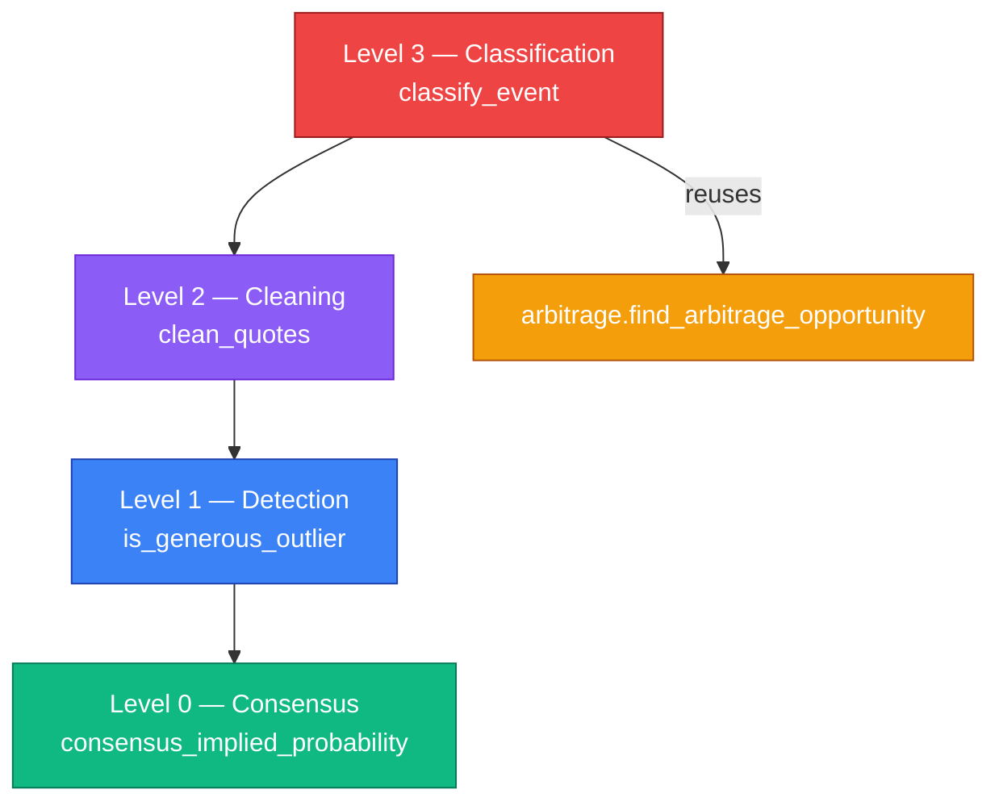

# Phantom Filtering — Design Specification

> Iteration 1 — pre-match, head-to-head (h2h) tennis markets only.
> This document specifies the filter that separates a *real arbitrage candidate*
> from a *phantom* before arbitrage detection runs, so that only plausible
> opportunities are flagged and notified.

## Goal

Distinguish a **candidate** (a cross-bookmaker arbitrage consistent with the market
consensus) from a **phantom** (an apparent arbitrage created by a single outlier
quote that contradicts the consensus), for pre-match h2h events.

The filter cleans the per-outcome quote set *before* the arbitrage math runs. Its job
is to remove the cause of false positives observed in Iteration 0 — a lone bookmaker
pricing an outcome very differently from the rest of the market — without suppressing
genuine, consensus-consistent arbitrages, regardless of their magnitude.

This is deliberately scoped to plausibility, not executability. A surviving candidate
is *worth looking at and notifying*; whether it could actually be filled (liquidity,
timing, stake limits) is a separate concern, deferred (see *Out of Scope*).

In-play phantoms are already handled upstream: the mapper rejects events whose
`commence_time` has passed (see `odds-api-integration.md`). This filter addresses a
*different* failure mode — a fresh-but-wrong pre-match quote.

## Vocabulary (Ubiquitous Language)

| Term | Definition |
|------|------------|
| **Consensus** (per outcome) | A robust central estimate of the implied probability for an outcome across all bookmakers. We use the **median** of implied probabilities, computed **once** over the full quote set for that outcome. The median is robust to a single outlier; the mean is not. |
| **Generous outlier** | A quote whose implied probability is far *below* its outcome's consensus (equivalently, odds far *above* the market) by more than a relative threshold. "Too good to be true" relative to the market — the safe assumption is a stale or mispriced source, not free money. |
| **Clean quote set** | The quotes remaining for an event after generous outliers are removed. |
| **Candidate** | An event whose clean quote set still yields total implied probability `< 1`, with a profit ratio within the plausibility cap and enough books per outcome. The thing we notify. |
| **Phantom** | An event whose apparent arbitrage disappears once outliers are removed, or whose surviving profit ratio exceeds the plausibility cap. Not notified. |
| **Low confidence** | An event with too few quotes on some outcome for the median to mean anything. Not classified as a candidate. |

Note: we say *candidate*, never *guaranteed profit*. The filter establishes
plausibility, not executability.

## Invariants

These properties must hold for any valid input. They are the properties verified by
the property-based tests in `tests/test_phantom_filtering.py`.

### P1. The filter cannot manufacture an arbitrage

Let `raw_T` be the total implied probability of the best-quote-per-outcome set over
all quotes, and `clean_T` the same over the clean quote set. Then:

$$\text{clean\_T} \geq \text{raw\_T}$$

Removing quotes can only lower (or keep) the maximum odds available per outcome, which
can only raise (or keep) the implied probability of the best surviving quote, hence
raise (or keep) the sum. Therefore **if the raw event is not an arbitrage, the clean
event is not one either** — the filter can only *remove* apparent arbitrages, never
create them. This is the core guarantee against fabricating phantoms.

### P2. Single-pass idempotence

The consensus median is computed **once** over the original quote set per outcome;
outlier rejection is a single pass against that fixed consensus. Therefore:

$$\text{clean}(\text{clean}(e)) = \text{clean}(e)$$

Recomputing the median on survivors is intentionally avoided, since it could make a
borderline survivor an outlier on a second pass (instability). Single-pass keeps the
result deterministic and idempotent.

### P3. Median robustness to a single outlier

Adding or removing one extreme quote on an outcome moves that outcome's consensus
median by at most the gap to the adjacent order statistic — never unboundedly. This is
why the median, not the mean, defines the consensus.

### P4. Minimum-books guard

If any outcome has fewer than `min_books_per_outcome` quotes, the median is unreliable
and the event is classified **low confidence** — never a candidate.

### P5. Plausibility cap

A **candidate** always has a profit ratio `<= max_profit_ratio`. A clean arbitrage
whose ratio exceeds the cap is reclassified as a **phantom** (belt-and-suspenders for
extreme survivors).

## Architecture in Layers

The filter is pure functions, layered bottom-up like the arbitrage math, and sits
*upstream* of the existing detection.



The arbitrage module (`arbitrage.py`) is unchanged: the filter produces a cleaned
`Event` and hands it to the existing `find_arbitrage_opportunity`. No bookmaker is
privileged a priori — there is no "Pinnacle is the truth" assumption; all books are
treated equally through the median, which is more robust than trusting a single
reference book. (The IT0 fixture is a reminder that even a normally-sharp book can
carry a stale or wrong quote in a given snapshot.)

## Public API

All functions are pure: same input, same output, no side effects. They operate on the
domain models in `src/arb_sentinel/models.py`. A new frozen model carries the result.

### Level 0 — Consensus

```python
def consensus_implied_probability(quotes_for_outcome: Iterable[Quote]) -> Decimal:
    """The market consensus implied probability for a single outcome: the median
    of the implied probabilities across all bookmakers quoting that outcome.

    Median (not mean) so a single outlier cannot move the consensus.
    """
```

### Level 1 — Detection

```python
def is_generous_outlier(
    implied_probability: Decimal,
    consensus: Decimal,
    relative_threshold: Decimal,
) -> bool:
    """Whether a quote is too generous relative to the market consensus.

    True when implied_probability < consensus * (1 - relative_threshold):
    the quote prices the outcome far more generously (higher odds) than the
    market median. Only the generous side is rejected — an abnormally
    pessimistic quote (low odds) is never selected as the best quote and so
    cannot create a false arbitrage.
    """
```

### Level 2 — Cleaning

```python
def clean_quotes(
    event: Event,
    relative_threshold: Decimal,
    min_books_per_outcome: int,
) -> CleanedEvent:
    """Remove generous outliers per outcome against the fixed consensus.

    The consensus is computed once per outcome over all quotes; each quote is
    then tested against it in a single pass. Returns a CleanedEvent that carries
    the filtered Event, the per-outcome book counts (before/after), and whether
    any outcome fell below min_books_per_outcome (low confidence).
    """
```

### Level 3 — Classification (composition)

```python
def classify_event(
    event: Event,
    total_stake: Decimal,
    relative_threshold: Decimal,
    min_books_per_outcome: int,
    max_profit_ratio: Decimal,
) -> PhantomFilterResult:
    """Classify an event as candidate / phantom / no_arbitrage / low_confidence.

    1. If any outcome has < min_books_per_outcome quotes -> low_confidence.
    2. Clean the quotes, then run find_arbitrage_opportunity on the cleaned event.
    3. If a clean arbitrage exists and its profit ratio <= max_profit_ratio
       -> candidate (carry the ArbitrageOpportunity).
    4. If a clean arbitrage exists but its ratio > max_profit_ratio -> phantom.
    5. If the raw event looked like an arbitrage but the clean one does not
       -> phantom (outlier-driven).
    6. Otherwise -> no_arbitrage.

    Only `candidate` results are notified. Every result is journaled.
    """
```

### Result model

```python
class PhantomFilterResult(BaseModel):
    """The outcome of phantom filtering for one event, at a point in time."""
    model_config = ConfigDict(frozen=True)

    classification: Literal["candidate", "phantom", "no_arbitrage", "low_confidence"]
    reason: str
    book_counts: dict[Outcome, int]
    raw_total_implied_probability: Decimal
    clean_total_implied_probability: Decimal | None
    opportunity: ArbitrageOpportunity | None
```

## Worked Example

The IT0 fixture (Arnaldi vs Collignon), pre-match, `relative_threshold = 0.20`,
`min_books_per_outcome = 4`, `max_profit_ratio = 0.10`.

**Outcome "Matteo Arnaldi"** — 15 books quote roughly 1.09–1.25, except Pinnacle at
1.68. Implied probabilities: most ≈ 0.80–0.92; Pinnacle ≈ 0.595.

- Consensus (median) ≈ **0.86**.
- Rejection bound: `0.86 * (1 - 0.20) = 0.688`.
- Pinnacle: `0.595 < 0.688` → **generous outlier, removed.**
- Best survivor: Matchbook at 1.25 → implied `0.80`. `0.80 < 0.688`? No → **kept.**

**Outcome "Raphael Collignon"** — books quote roughly 4.2–5.5; Pinnacle at 2.26
(implied ≈ 0.442) is far *above* the consensus. It is never the best quote (best is
5.5 → implied ≈ 0.182), so it does not affect detection; it is simply not selected.

**Clean detection.** Best surviving quotes: Arnaldi 1.25 (Matchbook) + Collignon 5.5
(Betclic).

$$\text{clean\_T} = \tfrac{1}{1.25} + \tfrac{1}{5.5} \approx 0.800 + 0.182 = 0.982 < 1$$

Profit ratio `= 1/0.982 - 1 ≈ 0.0185` (1.85%), within the 10% cap, book counts well
above 4 → **candidate** (notified).

**Contrast (no filter).** Raw best quotes would be Arnaldi 1.68 (Pinnacle) + Collignon
5.5: `raw_T ≈ 0.595 + 0.182 = 0.777` → a ~28.7% "arbitrage." This is the **phantom**
the filter removes — and note `clean_T (0.982) >= raw_T (0.777)`, consistent with P1.

A test (`test_fixture_pinnacle_outlier_is_phantom`) pins both: the raw ~28% is
classified phantom, and the ~1.85% survivor is classified candidate, keeping this
document and the implementation synchronized.

## Out of Scope (Future Iterations)

| Concern | Why deferred |
|---------|--------------|
| **Executability** (liquidity, partial fills, stake limits, timing) | IT1 is observation + notification only. A candidate is plausible, not proven fillable. |
| **Staleness filter** (`last_update`) | The outlier in the fixture is *fresh* (same-minute timestamp) but wrong, so freshness would not catch it. It would also require carrying per-quote timestamps in the domain model. Signal to revisit: IT1 observation shows fresh-timestamp-but-stale-price phantoms slipping through the consensus filter. |
| **Robust statistics** (MAD, z-score) | IT1 uses a simple relative threshold against the median. A median-absolute-deviation scheme is deferred until fixed thresholds prove too rigid across events with very different dispersion. |
| **Weighted / Bayesian consensus** (trusting sharper books more) | The median treats all books equally in IT1. Weighting introduces per-book trust parameters and tuning — deferred. |
| **Probing event counts via `/odds`** for tournament selection | Selection uses the free `/sports` endpoint and a priority list; probing would burn credits. |
| **Three-or-more-outcome events** (e.g. football 1X2) | h2h (2 outcomes) only in IT1; the consensus logic generalizes to N outcomes but is not exercised here. |
| **Adaptive thresholds via an AI agent** | Thresholds are static, documented knobs in IT1. Choosing them adaptively from observed data is the job of a future agent, gated by the Complexity Unlocks catalogue. |

## Thresholds

The thresholds are **documented, initial knobs**, to be refined by observation, not
final constants:

- `relative_threshold` — initial **0.20** (reject a quote whose implied probability is
  more than 20% below its outcome's consensus median). Validated on the IT0 fixture.
- `min_books_per_outcome` — initial **4** (below this the median is too weak to trust).
- `max_profit_ratio` — initial **0.10** (a clean pre-match h2h arbitrage above 10% is
  implausible and treated as a phantom).

Each detection is journaled with its classification, reason, margin, and book counts
(see ROADMAP, JSONL persistence), so the phantom rate is measurable and the thresholds
can be tuned from real observation.

## References

1. **Whelan, K. (2023).** *Calculating The Bookmaker's Margin.* UCD Centre for Economic Research, WP23/04. — Treatment of overround and the favorite-longshot bias, relevant to per-outcome deviation. https://www.ucd.ie/economics/t4media/WP23_04.pdf
2. **Arbitrage Betting — Wikipedia.** https://en.wikipedia.org/wiki/Arbitrage_betting — Mathematical formulation of the arbitrage condition this filter protects.
3. **The Odds API documentation v4.** https://the-odds-api.com/liveapi/guides/v4/ — Source taxonomy and the `last_update` field considered (and deferred) above.
4. **Evans, E. (2003).** *Domain-Driven Design.* Addison-Wesley. — "Ubiquitous Language" and "Value Object" patterns applied to the result model.

## Status

This specification corresponds to Iteration 1. It will be revised when:

- A staleness (`last_update`) signal is introduced (requires per-quote timestamps)
- Robust statistics (MAD) or weighted consensus replace the simple relative threshold
- Three-or-more-outcome events are supported
- Threshold selection becomes adaptive (AI agent)

Revisions are tracked in the project [ROADMAP](../../ROADMAP.md) decision log.
