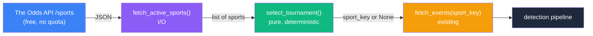

# Tournament Discovery & Selection — Design Specification

> Iteration 1 — replace the hardcoded `sport_key` with dynamic, free discovery of the
> active tennis tournament to observe, selected by a deterministic priority rule.

## Goal

Decide, at each polling cycle, **which single tennis tournament to observe**, without
hardcoding it and without spending API quota on the decision.

Iteration 0 hardcoded `tennis_atp_french_open`, so the system observed nothing
out of season and ignored whichever tournament was actually live. Iteration 1 instead:

1. Discovers the active tennis tournaments from The Odds API `/sports` endpoint, which
   **does not count against the usage quota** (discovery is free).
2. Selects **one** tournament via a configurable, deterministic priority list.
3. Returns nothing when no tennis tournament is active, so the cycle spends **0 credits**
   out of season.

The Odds API's tennis coverage is limited to the **Grand Slams, ATP 1000/500, and WTA
1000/500** (no Challengers, ITF, or 250-level events), so the universe of tennis
`sport_key`s is small and stable. `/sports` is the canonical, free source for the exact
keys and their current `active` status — we never hardcode or maintain a tournament
list ourselves; we only maintain a short *preference* ordering.

The selected `sport_key` is then handed to the existing `fetch_events(sport_key, ...)`.
Observing a single tournament keeps the cost at ~1 credit per cycle, preserving the
windowed cadence decided for IT1.

## Vocabulary

| Term | Definition |
|------|------------|
| **`/sports` response** | A list of competitions, each with at least: `key` (e.g. `tennis_atp_french_open`), `group` (e.g. `"Tennis"`), `title`, `description`, `active` (bool), `has_outrights` (bool). Exact fields are confirmed against the live response at implementation. |
| **Tennis tournament** | A competition whose `group` is `"Tennis"` — equivalently, whose `key` starts with `tennis_`. The `key`-prefix test is the verified one (the IT0 fixture uses `tennis_atp_french_open`). |
| **Active** | The competition's `active` flag is `true` (it currently has, or is about to have, listed events). |
| **Priority list** | A configurable, ordered sequence of preferred `sport_key`s. Top-tier tournaments first, because they have the most simultaneous matches and the best bookmaker coverage (which the phantom filter's consensus median depends on). |
| **Selected sport_key** | The single `sport_key` the cycle will poll, or `None` when no tennis tournament is active. |

## Invariants

Verified by tests in `tests/test_tournament_selection.py`. Selection is a pure function,
so these are straightforward to property-test.

- **INV1 — Deterministic.** For the same inputs (`active_sports`, `priority`), selection
  always returns the same result. No randomness, no hidden state, no I/O.
- **INV2 — Tennis-only and active.** A returned `sport_key` is always an *active tennis*
  tournament present in the input — never another sport, never an inactive one.
- **INV3 — Priority respected.** If any priority-list key is active, the result is the
  first one in priority order; a higher-priority active tournament is always preferred
  over a lower-priority one.
- **INV4 — Deterministic fallback.** If no priority-list key is active but at least one
  tennis tournament is, the result is an active tennis key chosen by a stable order
  (sorted by `key`).
- **INV5 — Empty → None.** If no tennis tournament is active, the result is `None`, and
  the caller polls nothing (0 credits that cycle).

## Architecture

The split mirrors the rest of the codebase: **I/O is isolated, selection is pure.**



`fetch_active_sports` lives in `src/arb_sentinel/odds_api.py` alongside the existing API
schemas and client (same source, same module). `select_tournament` is a pure function
(also in `odds_api.py`), unit- and property-testable with no network. The orchestration
in `__init__.py` wires them: discover → select → if `None`, log and skip; else
`fetch_events(selected)`.

## Public API

```python
class OddsApiSport(BaseModel):
    """A competition entry from the /sports endpoint. Frozen, mirrors the API shape."""
    model_config = ConfigDict(frozen=True)
    key: str
    group: str
    title: str
    description: str
    active: bool
    has_outrights: bool


def fetch_active_sports(api_key: str) -> list[OddsApiSport]:
    """Fetch the competitions list from The Odds API /sports endpoint.

    This endpoint does not count against the usage quota. Raises
    httpx.HTTPStatusError on non-2xx responses; the caller decides how to react.
    """


def select_tournament(
    active_sports: Iterable[OddsApiSport],
    priority: Sequence[str],
) -> str | None:
    """The single tennis tournament sport_key to observe, or None. Pure and deterministic.

    Filters to active tennis tournaments, then:
    - returns the first key in `priority` (priority order) that is active; else
    - returns the first active tennis key by stable order (sorted by key); else
    - returns None (no tennis tournament active).
    """
```

## Selection rule and default priority

The default priority list is the four Grand Slams (ATP and WTA), highest coverage first.
It is a **documented, configurable preference**, not a hardcoded path — refine it freely.

Because Odds API tennis coverage is only Grand Slams + ATP/WTA 1000/500, this short list
plus the fallback already covers everything: when no Slam is active, the fallback selects
whichever 1000/500 event is live. No finer tiering is needed for IT1. The list can live
as a documented constant in code, or as a small config file (TOML/JSON) if you prefer to
edit it without touching code — not a spreadsheet, which would be overkill for ~8 keys.

Initial value (exact keys confirmed against the live `/sports` response at
implementation; only `tennis_atp_french_open` is verified here, from the IT0 fixture):

```
tennis_atp_aus_open,    tennis_wta_aus_open,
tennis_atp_french_open, tennis_wta_french_open,
tennis_atp_wimbledon,   tennis_wta_wimbledon,
tennis_atp_us_open,     tennis_wta_us_open
```

When both the ATP and WTA draw of the same Slam are active, the higher one in the list
wins and is observed alone (one tournament per cycle). Covering both simultaneously is a
multi-tournament concern — out of scope (see below).

## Worked Example

`/sports` returns: French Open ATP (active), an ATP 250 (active), and several football
competitions (active), `priority` = the Grand Slam list above.

- Filter to active tennis → French Open ATP, the ATP 250.
- First priority key that is active → `tennis_atp_french_open`. **Selected.**

Other cases:
- Only the ATP 250 is active (no Slam) → fallback returns the ATP 250 key (stable order).
- No tennis active (off-season) → `None`; the cycle polls nothing and spends 0 credits.

## Out of Scope (Future Iterations)

| Concern | Why deferred |
|---------|--------------|
| **Polling multiple tournaments per cycle** ("all active tennis") | Multiplies credits per cycle and divides cadence. Gated: revisit only if IT1 observation shows a single tournament is too thin. |
| **Intelligent / adaptive selection** (by observed liquidity, volatility, historical arb rate) | A future AI agent's job; IT1 selection is deterministic by design. |
| **Probing event counts via `/odds` to pick the busiest** | `/odds` costs credits; `/sports` does not expose counts. A priority list is the free proxy. |
| **Other sports / non-h2h markets** | IT1 stays tennis / h2h (validated domain). |
| **In-play** | Pre-match only; in-play events are filtered at the mapper. |

## References

1. **The Odds API — Sports endpoint.** https://the-odds-api.com/liveapi/guides/v4/#get-sports — Response shape and the note that `/sports` does not affect the usage quota.
2. **The Odds API — Tennis coverage.** https://the-odds-api.com/sports/tennis-odds.html — Confirms coverage is limited to Grand Slams, ATP 1000/500, and WTA 1000/500.
3. **arb-sentinel ROADMAP decision log** — "Dynamic tournament selection (deterministic, not intelligent)".
4. `docs/design/odds-api-integration.md` — the existing fetch/mapping integration this extends.

## Status

This specification corresponds to Iteration 1. It will be revised when:

- Multiple tournaments are observed per cycle (the single-selection rule generalizes)
- Selection becomes adaptive (an AI agent replaces the priority list)

Revisions are tracked in the project [ROADMAP](../../ROADMAP.md) decision log.
